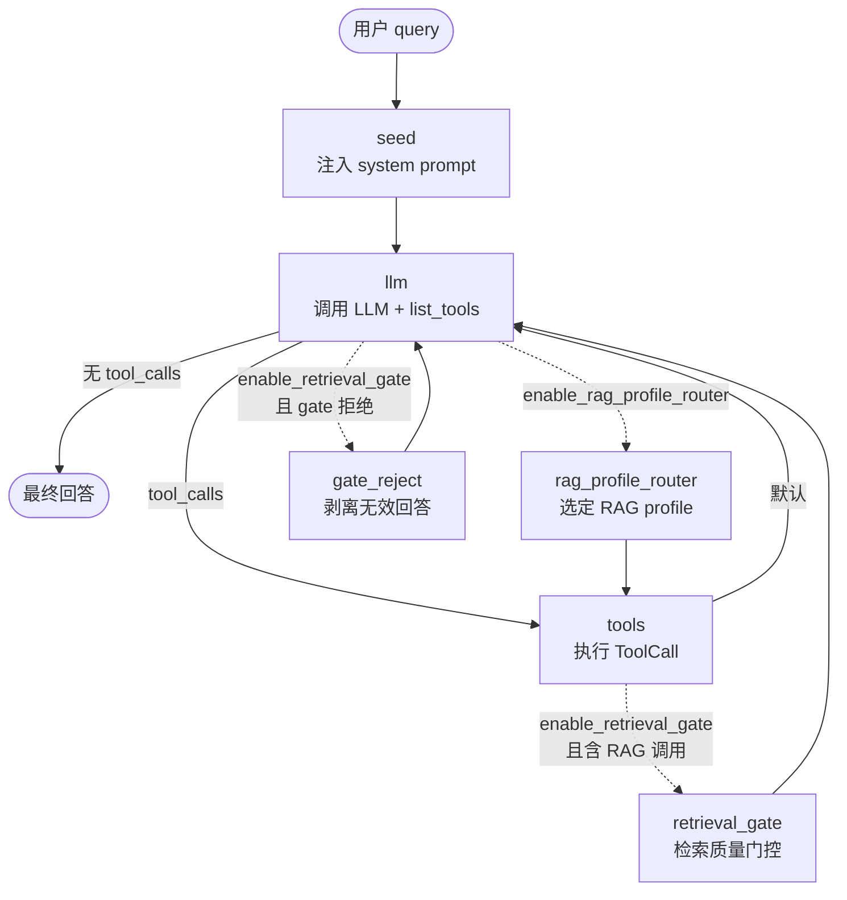
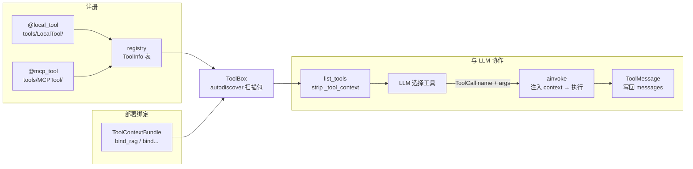
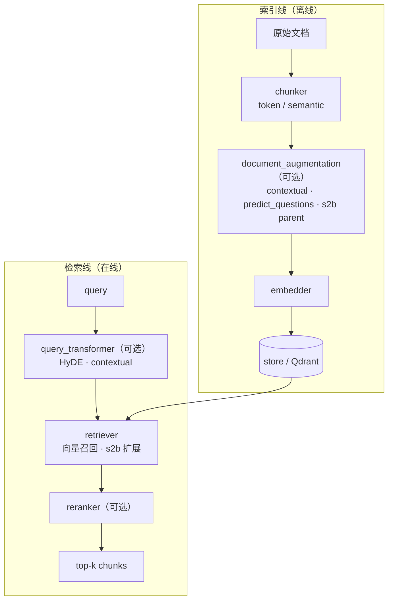

# Composer-Agentic_RAG

一个可插拔 AI 运行框架（Harness）——Agent + Tool + RAG 三层架构；Agent 按需挂载 capability，Tool 层可扩展 MCP / Local Tool，RAG 通过 profile 组合索引与检索策略。

**状态**：

- RAG：**可用**
- Agent：**可用**
- 评测：RAG 检索（BEIR）**已完成**；RAG + Agent 管线（Easy Dataset + RAGChecker）**实现中**

---

## 特性概览

- **RAG 可独立使用**：建库 / 检索与 Agent 解耦，`rag/` 单独 import 即可
- **Profile 开关组合**：chunk 策略、contextual、s2b、HyDE、rerank 等通过 `arg_config.yaml` profile 切换
- **Agent 能力插件**：Retrieval Gate、RAG Profile Router、Human Feedback 等 capability 独立 toggle
- **工具可扩展**：`ToolBox` 自动发现 Local Tool 与 MCP Tool
- **可观测**：index / retrieve 可 dump JSONL trace（见 `get_start/`）
- **评测**：RAG 检索 BEIR 已跑通；RAG + Agent 管线（Easy Dataset + RAGChecker）实现中

---

## 架构

三层解耦：**Agent** 编排决策，**Tool** 暴露能力给 LLM，**RAG** 独立建库与检索。Agent 不直接 import retriever，经 `RAG_search_tool` 调用 RAG。

### Agent 层（LangGraph）

`build_agent(AgentConfig)` 组装核心 ReAct 环；capabilities 按配置追加节点与边。



状态在 `AgentState.messages` 中流转；LLM 与 tools 节点通过 `AgentToolBox` 访问 `tools.ToolBox`。

### Tool 层（ToolBox）



### RAG 层（Index / Retrieve）

Profile（`arg_config.yaml`）决定各阶段开关组合。



配置入口：RAG → `arg_config.yaml` profile；Agent → `AgentConfig` capability toggles。

---

## 快速开始

前置条件（`get_start/` 示例均依赖 **Qdrant**，默认 `127.0.0.1:6333`）：

| 条件 | RAG demo | Agent demo |
|------|:--------:|:----------:|
| Python 3.10+，`pip install -r requirements.txt` | ✓ | ✓ |
| `.env`（见 `.env.example`） | ✓ | ✓ |
| Qdrant `127.0.0.1:6333` | ✓ | ✓ |
| 先跑 `index_example` | — | ✓ |

启动 Qdrant（任选其一）：

```bash
docker compose up -d qdrant    # 推荐，数据持久化到 ./qdrant_data
# 或本机已安装的 Qdrant 监听 6333
```

### 安装

```bash
pip install -r requirements.txt
copy .env.example .env   # Windows；Unix: cp .env.example .env
```

### 环境变量

完整列表见 `.env.example`。`get_start/` 最少需要：

| 变量 | 用途 |
|------|------|
| `EMBEDDING_*` | 建库与向量检索（RAG / Agent 共用） |
| `LLM_*` | Agent 对话；`baseline` profile 的 contextual enrich 也需 LLM |
| `RERANK_*` | `--pattern crag` / `crag_self_rag` 时 retrieval gate 打分 |
| `BOCHA_API_KEY` / `TAVILY_*` | 可选；`agent_example --web` 联网搜索 |

### RAG：索引 → 检索（推荐第一步）

```bash
# 1. 索引 fixture 文章 → Qdrant collection getstart_codex_baseline
#    输出 get_start/runs/index.jsonl
python -m get_start.index_example

# 2. 同一 collection 检索，输出 get_start/runs/retrieve.json
python -m get_start.retrieve_example
```

预期：`retrieve_example` 终端打印 `hits=…` 与 trace 键；`runs/index.jsonl` 为入库 chunk 快照，`runs/retrieve.json` 含各阶段检索 trace。

可调：示例内改 `_PROFILE_ID`（默认 `baseline`，须与 `arg_config.yaml` 中 profile 一致）；`retrieve_example` 改 `_QUERY`。

### Agent：pattern 示例

前置：已完成上节索引（同一 collection `getstart_codex_baseline`）。

```bash
python -m get_start.agent_example --pattern self_rag
python -m get_start.agent_example --pattern crag          # 需 RERANK_* 或 EMBEDDING_*
python -m get_start.agent_example --pattern crag_self_rag
```

可选参数：`--query`、`--profile-id`、`--collection`、`--web`（联网，需搜索 API key）。

预期：终端打印对话与 `gate_verdict` / `rag_profile`（若 pattern 启用）；输出 `get_start/runs/agent_<pattern>.json` 与 `.txt`。

Pattern 与 capability 对应关系见 `agent_arg_config.yaml`；底层由 `build_agent` 组装图。

---

## RAG 配置

RAG 行为由根目录 `arg_config.yaml` 统一控制，分两层：

1. **全局参数** — 所有 profile 共享的数值旋钮  
2. **Profile** — 索引 / 检索管线组件的开关组合（`use_*` 布尔字段）

> 交互式调参（网格搜索、ablation 编排等）**规划中**；当前直接改 YAML 或示例脚本里的 `_PROFILE_ID`。

### 全局参数

| 节 | 字段 | 含义 |
|----|------|------|
| `chunker` | `chunk_tokens` / `overlap_tokens` | 分块大小与重叠 |
| | `break_similarity` | SemanticChunker 断句相似度阈值 |
| | `min_chunk_tokens` | 最小 chunk 长度（s2b child） |
| `retriever` | `recall_n` | 向量初召回条数（rerank 前） |
| | `top_k` | 最终返回条数 |

代码读取：`config = get_rag_config()` → `config.chunker` / `config.retriever`。

### Profile（组件开关）

Profile 只声明 `use_*` 开关；未写的字段默认为 `false`。`get_start/` 默认 `baseline`。

| profile_id | 典型用途 | 索引侧 | 检索侧 |
|------------|----------|--------|--------|
| `baseline` | 默认上手 | contextual | rerank |
| `baseline_hyde` | + 查询扩展 | contextual | HyDE + rerank |
| `baseline_s2b` | + small-to-big | contextual + s2b | rerank |
| `full` | ablation 全开 | contextual + s2b + predict_q | HyDE + rerank |
| `token` / `semantic` | 对照组 | token 或 semantic chunk | 向量召回 |

完整列表见 `arg_config.yaml` → `profiles`。

### 在代码中切换

```python
from rag.config import get_profile, get_rag_config

config = get_rag_config()
profile = get_profile(config, "baseline")

indexer = build_RAG_indexer(
    collection,
    use_token_chunker=profile.use_token_chunker,
    use_contextual=profile.use_contextual,
    use_predict_questions=profile.use_predict_questions,
    use_small_to_big=profile.use_small_to_big,
)
retriever = build_RAG_retriever(
    collection,
    use_reranker=profile.use_reranker,
    use_contextual=profile.use_contextual,
    use_hyde=profile.use_hyde,
    use_small_to_big=profile.use_small_to_big,
)
```

`get_start/` 示例：改各脚本顶部的 `_PROFILE_ID`，索引与检索须保持一致。

---

## Agent

公开 API：`from agent import AgentConfig, build_agent`。`build_agent(AgentConfig)` 组装 LangGraph ReAct 图；capabilities 是**独立开关**，按需叠加节点与边，LLM 始终是决策中心。

### 两层配置

| 层 | 文件 / 类型 | 管什么 |
|----|-------------|--------|
| **Capability** | `AgentConfig`（`agent/config.py`） | 运行时开关、工具名、各 capability 细项 |
| **Pattern 预设** | `agent_arg_config.yaml` | 把常用 capability 组合命名（`self_rag`、`crag` 等），供 `get_start` / 评测复用 |

RAG 部署（`collection`、`profile_id`）在运行时注入：构造 `ToolBox` 前对 `ToolContextBundle` 调用 `bind_rag`，或使用 `RequestConfig` + `build_run`（见 [工具系统 → 部署 Context](#部署-context)）。

### Capability 开关（`AgentConfig`）

| 配置项 | 作用 | 默认 |
|--------|------|------|
| `enable_retrieval_gate` | RAG 调用后做检索质量门控，不合格则剥离回答、回 LLM 重试 | off |
| `enable_rag_profile_router` | 按 query 路由 RAG profile，再执行检索 | off |
| `enable_human_feedback` | 人机澄清工具 + checkpoint（需 `checkpointer`） | off |
| `enable_web_search` | 向 LLM 暴露联网工具 | on |
| `rag_tool_name` / `web_tool_name` | 工具名（与 `ToolBox` 注册名一致） | `RAG_search_tool` / web 默认名 |
| `system_prompt_key` | `agent/prompt/system_prompt.yaml` 中的 prompt 键 | `default` |

各 capability 另有可选子配置：`retrieval_gate`、`rag_profile_router`、`human_feedback`。

### Pattern 预设（`agent_arg_config.yaml`）

| pattern | retrieval_gate | rag_profile_router | human_feedback |
|---------|:--------------:|:------------------:|:--------------:|
| `react` | | | |
| `self_rag` | | ✓ | |
| `crag` | ✓ | | |
| `crag_self_rag` | ✓ | ✓ | |
| `feedback` | | | ✓ |
| `full` | ✓ | ✓ | ✓ |

全局 `rag_context.max_chunks`：注入 LLM 的 RAG 上下文条数上限；`null` 时默认 `3 × retriever.top_k`（见 `arg_config.yaml`）。

### 构建方式

**方式 A — 直接配 `AgentConfig`（推荐集成）**

```python
from langchain_core.messages import HumanMessage

from agent import AgentConfig, build_agent
from llm.client import LLMClient
from rag.context import bind_rag
from tools.context import ToolContextBundle
from tools.tool_box import ToolBox

bundle = ToolContextBundle()
bind_rag(
    bundle,
    collection="my_collection",
    index_profile_id="baseline",
    retrieve_profile_id="baseline",
)
tool_box = ToolBox(context=bundle)

graph = build_agent(
    AgentConfig(
        llm=LLMClient(),
        tool_box=tool_box,
        enable_retrieval_gate=True,
        enable_rag_profile_router=False,
        enable_web_search=False,
    )
)
try:
    result = await graph.ainvoke({"messages": [HumanMessage(content="…")], "metadata": {}})
finally:
    await tool_box.aclose()
```

**方式 B — Pattern 预设（与 `get_start` 相同）**

```python
from agent.pattern.common import RequestConfig, build_run

run = build_run(
    RequestConfig(
        pattern_id="crag",
        collection="getstart_codex_baseline",
        index_profile_id="baseline",
        retrieve_profile_id="rerank_contextual",
        enable_web_search=False,
    )
)
try:
    result = await run.graph.ainvoke(
        {"messages": [HumanMessage(content="…")], "metadata": {}}
    )
finally:
    await run.aclose()
```

可运行示例见 [快速开始 → Agent](#agentpattern-示例)。图结构见 [架构 → Agent 层](#agent-层langgraph)。

---

## 工具系统

`ToolBox`（`tools/tool_box.py`）是工具的注册表与运行时。Agent 经 `AgentToolBox` 包装后按 capability 过滤 schema，底层仍调用同一套 `list_tools` / `ainvoke`。

### 注册与发现

模块加载时，`@local_tool` / `@mcp_tool`（`tools/registry.py`）把函数登记到全局 `ToolInfo` 表。`ToolBox()` 默认扫描：

- `tools.LocalTool` — 进程内 Python 函数（RAG、数学等）
- `tools.MCPTool` — 薄封装，内部通过 MCP 客户端调用外部服务

```python
from tools.registry import local_tool

@local_tool
def my_tool(query: str) -> str:
    """工具描述会进入 LLM 可见的 schema。"""
    ...
```

在 `tools/LocalTool/` 或 `tools/MCPTool/` 新增模块即可；无需改 `ToolBox` 源码。查看已注册工具：

```bash
python -m tools.tool_box list
```

### LLM 如何看到工具

每次 `llm` 节点调用前，`tool_box.list_tools()` 把注册表转为 **OpenAI function schema** 列表，传给 `LLMClient.arequest_llm(..., tools=...)`。LLM 据此决定调用哪个工具及参数。

在 Agent 图中，`AgentToolBox` 还会在 `list_tools` 时按配置过滤（如关闭 `enable_web_search` 时隐藏 `tavily_search`；未开 profile router 时把 `RAG_search_tool` 限制为仅 `query` 参数）。

### ToolCall 如何执行

1. LLM 返回带 `tool_calls` 的 `AIMessage`（`name` + `args` + `id`）
2. `tools` 节点遍历每条 call，调用 `tool_box.ainvoke(name, args)`
3. `ToolBox.ainvoke`：查注册表 → 校验 `context_keys` 已 bind → 注入 `_tool_context` → `resolve(tool_path)` 加载函数 → 执行（async 直接 `await`，sync 直接调用）
4. 结果封装为 `ToolResult`（`output` 或 `error`），写成 `ToolMessage` 追加到 `messages`，回到 `llm` 节点

MCP 工具与 local 工具走同一 `ainvoke` 路径；区别仅在函数体内是否转发到 MCP server。

### 部署 Context

需要运行时资源的工具（如 RAG）在装饰器上声明 `context_keys`，启动时对 `ToolContextBundle` 执行 `bind`，再传入 `ToolBox(context=bundle)`。LLM 只见业务参数（`query` 等）；`list_tools` 会从 schema 中剔除 `_tool_context`。

```python
from rag.context import bind_rag
from tools.context import ToolContextBundle
from tools.tool_box import ToolBox

bundle = ToolContextBundle()
bind_rag(bundle, collection="my_collection", retrieve_profile_id="baseline")
tool_box = ToolBox(context=bundle)
```

详细机制见 [`docs/tools/tool_box.md`](docs/tools/tool_box.md#部署-context)。

### 内置工具一览

| 工具 | 类型 | 作用 |
|------|------|------|
| `RAG_search_tool` / `RAG_index_tool` | local | 检索 / 入库（须先 `bind_rag(bundle, ...)`） |
| `tavily_search` / `tavily_extract` | mcp | 联网搜索 / 页面抽取 |
| `convert_document` / `convert_with_ocr` | mcp | 文档 → Markdown（Markitdown） |
| `integrate_function` | local | 示例数学工具 |

---

## 评测

| 阶段 | 评什么 | 状态 |
|------|--------|------|
| **RAG 检索** | profile ablation，BEIR / HotpotQA | ✅ 已完成（`legacy/_eval_`） |
| **RAG + Agent 端到端** | Easy Dataset 出题 → 跑候选答案 → RAGChecker | 🚧 实现中 |

端到端管线：语料生成 QA → Agent / RAG 产出答案 → RAGChecker 打分（可选 rubric）。详细跑分见 `docs/RAG_retrieve_eval_results.md`（检索）、`docs/Eval_report.md`（端到端，待补）。

### 两代指标差异（简）

**上一代 — 只评检索排序**（例：HotpotQA `token` profile）

| 指标 | 含义 |
|------|------|
| `recall@k` / `hit@k` | gold 文档是否出现在 top-k |
| `ndcg@k` | 排序质量 |
| `mrr@k` | 首个相关结果的平均倒数排名 |

**这一代 — 评答案与 claim**（RAGChecker，例：`checking_outputs.json`）

| 侧 | 代表指标 | 含义 |
|----|----------|------|
| 检索 | `claim_recall`、`context_precision` | 证据是否召回、上下文是否干净 |
| 生成 | `faithfulness`、`hallucination` | 答案是否忠于上下文、是否编造 |
| 综合 | `precision` / `recall` / `f1` | claim 级对齐 |

上一代回答「找对了没有」；这一代回答「答对了没有、有没有胡编」。

单元测试在 `tests/`（`pytest`，无 API key）；离线评测需 key，不进 CI。

---

## 项目结构

定制入口（其余顶层目录：`get_start/` 示例、`llm/` 客户端、`tests/` 单测、`docs/` 文档、`legacy/` 旧代码可忽略）。端到端评测已独立到 sibling 项目 **composer-eval**（本仓库 `eval/` 仅保留 README 与历史 data 归档）：

```
composer-agentic_rag/
├── arg_config.yaml              # RAG 全局参数 + profile 开关
├── agent_arg_config.yaml        # Agent pattern 预设（capability 组合）
│
├── agent/
│   ├── builder.py               # 组图：核心节点 + capability 边
│   ├── config.py                # AgentConfig capability 开关
│   ├── capabilities/            # ← 新增 capability
│   │   ├── protocol.py          #    Capability.register(graph, config)
│   │   ├── retrieval_gate/      #    参考：node · config · capability.py
│   │   ├── rag_profile_router/
│   │   └── human_feedback/
│   ├── core/nodes/              #    seed · llm · tools（一般不改）
│   ├── core/edges/              #    路由策略（加 capability 时可能要改）
│   ├── pattern/                 #    pattern → AgentConfig 映射（get_start 用）
│   └── prompt/system_prompt.yaml
│
├── rag/
│   ├── build.py                 # build_RAG_indexer / build_RAG_retriever 组装
│   ├── config.py                # 读取 arg_config.yaml
│   ├── core.py                  # RAGIndexer / RAGRetriever 管线编排
│   ├── context.py               # bind_rag → ToolContextBundle（RAG 部署）
│   ├── chunker/                 # ← 分块策略
│   ├── document_augmentation/   # ← 索引期增强（contextual · predict_q · s2b）
│   ├── embedder/
│   ├── store/                   #    Qdrant
│   ├── retriever/               # ← 召回逻辑
│   ├── query_transformer/       # ← 查询变换（HyDE 等）
│   └── reranker/
│
└── tools/
    ├── context.py               # ToolContextBundle（部署绑定，ainvoke 注入）
    ├── registry.py              # @local_tool · @mcp_tool 装饰器
    ├── tool_box.py              # 发现 · list_tools · ainvoke
    ├── LocalTool/               # ← 新增本地工具（加 .py + 装饰器即可）
    └── MCPTool/                 # ← 新增 MCP 封装
```

---

## 测试

测试目录：`tests/rag`、`tests/agent`、`tests/tools`（配置见 `tests/pytest.ini`）。

```bash
pytest -c tests/pytest.ini -m "not slow and not requires_api"   # 日常，无需 API key
pytest -c tests/pytest.ini -m requires_api                       # 需 .env 中的 LLM / Embedding key
pytest -c tests/pytest.ini                                       # 全量
```

常用 marker：`unit` · `integration` · `slow` · `requires_api`。

---

## 延伸阅读

主文档即本 README。`docs/` 存放**选型指南**与**评测跑分报告**（随结果补充）：

| 文档 | 内容 |
|------|------|
| `docs/profile_capability_selection.md` | RAG profile 与 Agent capability / pattern 选型（优劣势、组合建议） |
| `docs/RAG_retrieve_eval_results.md` | RAG 检索 ablation（BEIR / HotpotQA 等） |
| `docs/Eval_report.md` | RAG + Agent 端到端（Easy Dataset + RAGChecker） |

配置与代码入口见上文 [RAG 配置](#rag-配置)、[Agent](#agent)、[项目结构](#项目结构)。

---

## License

[MIT](LICENSE) © 2026 joeyc

致谢：LangGraph · LangChain · Qdrant · RAGChecker · BEIR · Easy Dataset。
