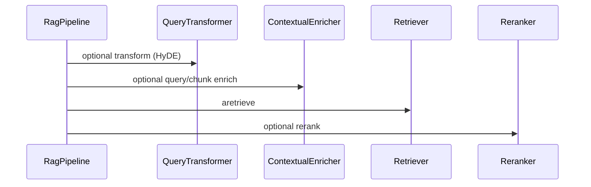
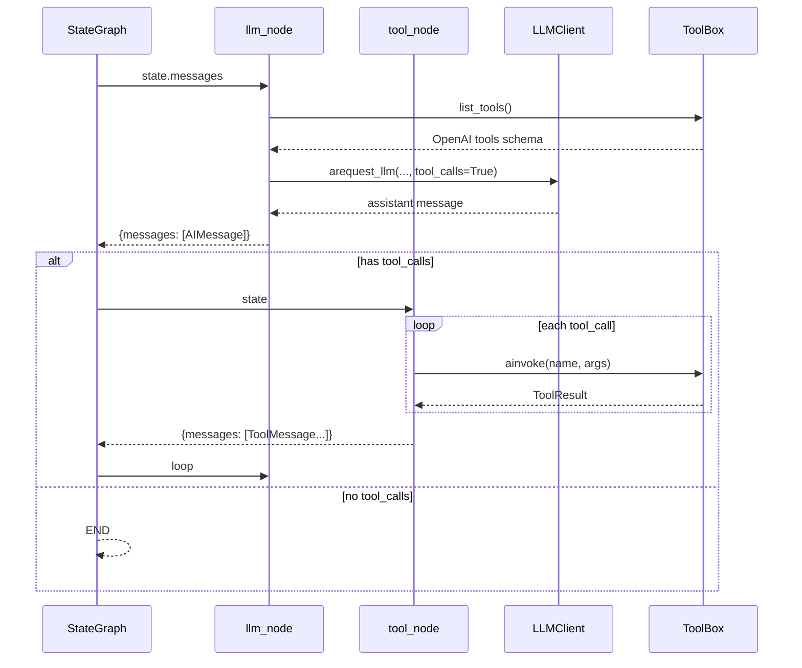
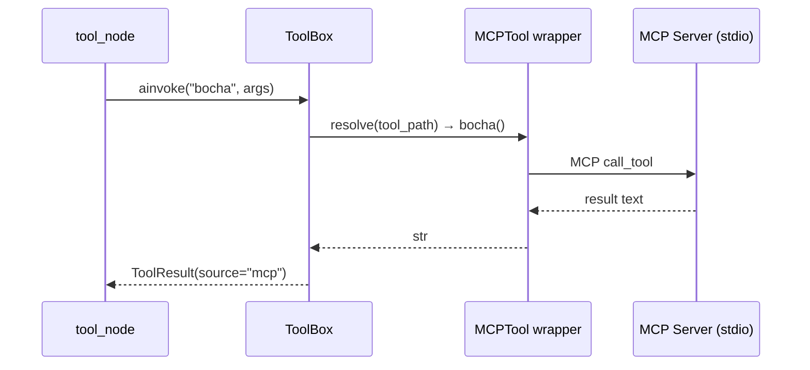

# RAG Framework Architecture Design

> Personal engineering practice — modular, pluggable, LangGraph-based  
> **Doc policy:** English; **as-implemented** sections reflect the repo today; **Roadmap** sections describe reserved interfaces not yet built.

---

## 1. Design Goals


| Goal                  | Detail                                                                                                   |
| --------------------- | -------------------------------------------------------------------------------------------------------- |
| **Modular**           | Every upgradable component is an independent module with a clear interface                               |
| **Pluggable RAG**     | Swap chunker / embedder / store / retriever / reranker / query transformer without changing the pipeline |
| **LangGraph Agent**   | ReAct loop as a `StateGraph`; checkpointing via LangGraph checkpointer                                   |
| **Tool abstraction**  | Unified `ToolBox` — metadata registry, lazy `tool_path` resolve, `list_tools` + `ainvoke` for local and MCP |
| **Extension-ready**   | Reserved hooks for MCP tools, A2A agents, and `AgentHarness` (lifecycle, patterns, observability)        |
| **Async-first**       | I/O-bound paths use async; sync wrappers where needed (e.g. `RagPipeline.as_tool`)                       |
| **Engineering-grade** | ABCs for RAG contracts; typed `AgentState`; explicit message adapters                                    |


---

## 2. Directory Structure

### 2.1 Current layout

```
RagPipeLine/
│
├── llm/
│   └── client.py              # LLMClient (sync + async OpenAI-compatible API)
│
├── tools/
│   ├── tool_box.py            # ToolBox, ToolInfo — register, resolve, list_tools, ainvoke
│   ├── tool_result.py         # ToolResult dataclass
│   ├── registry.py            # register_defaults / register_rag_tools / register_mcp_tools
│   ├── LocalTool/
│   │   ├── math_tool.py       # integrate_function
│   │   └── RAG_tool.py        # RAG_index_tool, RAG_search_tool + bind_indexer / bind_retriever
│   └── MCPTool/
│       ├── _client.py         # call_mcp_tool (stdio MCP)
│       ├── _config.py         # MCPServerConfig from env
│       ├── markitdown_tool.py # convert_document, convert_with_ocr
│       └── search_tool.py     # bocha
│
├── rag/
│   ├── base.py                # Chunk + RAG ABCs
│   ├── core.py                # RagPipeline — aindex / aquery / as_tool
│   ├── simple.py              # build_simple_pipeline() factory
│   ├── chunker/
│   │   ├── md_chunker.py      # MarkdownChunker
│   │   └── semantic_chunker.py
│   ├── embedder/
│   │   └── openai_embedder.py
│   ├── store/
│   │   └── qdrant_store.py
│   ├── retriever/
│   │   ├── vector_retriever.py
│   │   └── hybrid_retriever.py
│   ├── reranker/
│   │   └── cross_encoder_reranker.py
│   └── query_transformer/
│       └── hybe.py            # HyDE (typo in filename; rename → hyde.py planned)
│
├── agent/
│   ├── state.py               # AgentState (LangGraph add_messages)
│   ├── messages.py            # OpenAI ↔ LangChain message adapters
│   ├── nodes.py               # llm_node, tool_node
│   └── graph.py               # AgentConfig, routing, graph compile
│
├── legacy/                    # Original prototypes (reference only)
│   ├── my_agent_client.py
│   ├── my_tool_box.py
│   ├── my_ReAct_loop.py
│   └── MdProcessor.py
│
├── requirements.txt
└── FRAMEWORK_DESIGN.md
```

### 2.2 Planned layout (Roadmap)

```
RagPipeLine/
│
├── agent/
│   ├── harness/               # AgentHarness — lifecycle, patterns, observability
│   │   ├── __init__.py
│   │   ├── base.py            # AgentHarness ABC
│   │   ├── react_harness.py   # wraps build_agent(pattern="react")
│   │   └── callbacks.py       # logging / tracing hooks
│   └── graph.py               # build_agent(pattern=...) — unified entry
│
├── a2a/                       # Agent-to-Agent (placeholder)
│   └── __init__.py            # protocol / remote agent adapter — TBD
│
└── tools/                     # LocalTool + MCPTool wrappers (see §5)
```

---

## 3. Configuration & Environment

`LLMClient` loads defaults from `.env` via `python-dotenv`:


| Variable       | Used by     | Description                |
| -------------- | ----------- | -------------------------- |
| `LLM_MODEL_ID` | `LLMClient` | Default chat model         |
| `LLM_API_KEY`  | `LLMClient` | API key                    |
| `LLM_BASE_URL` | `LLMClient` | OpenAI-compatible base URL |


Constructor kwargs override env vars: `api_key`, `base_url`, `model`, `timeout`.

**MCP tools** (optional — see `tools/MCPTool/`):


| Variable | Used by | Description |
| -------- | ------- | ----------- |
| `MARKITDOWN_MCP_COMMAND` | Markitdown wrapper | Default `markitdown-mcp` |
| `OPENAI_API_KEY` / `LLM_API_KEY` | `convert_with_ocr` | Vision LLM for OCR plugin |
| `MARKITDOWN_OCR_MODEL` / `LLM_MODEL_ID` | `convert_with_ocr` | OCR model id |
| `BOCHA_API_KEY` | `bocha` search | Bocha AI API key |
| `BOCHA_MCP_COMMAND` | Bocha wrapper | Default `bocha-search-mcp` |

Install optional MCP servers separately: `pip install markitdown-mcp bocha-search-mcp`.

**Planned (Roadmap):** `EMBEDDING_*`, `QDRANT_*` — expand when embedding / store config is centralized.

---

## 4. Layer 1 — LLMClient

**Status: implemented** (`llm/client.py`)

- Sync `request_llm` and async `arequest_llm` share `_build_create_kwargs`.
- Boolean flags: `json_output`, `tool_calls`, `stream` (stream raises `NotImplementedError`).
- `tools` argument required when `tool_calls=True` (OpenAI tools schema from `ToolBox.list_tools()`).
- Per-call model override: `kwargs["model"]`.

```python
class LLMClient:
    def request_llm(
        self,
        messages: List[Dict],
        json_output: bool = False,
        tool_calls: bool = False,
        stream: bool = False,
        tools: List[Dict] | None = None,
        **kwargs,
    ): ...

    async def arequest_llm(...): ...  # same signature
```


| Item                   | Status                       |
| ---------------------- | ---------------------------- |
| Sync / async chat      | Done                         |
| `json_output`          | Done                         |
| `tool_calls` + `tools` | Done                         |
| `stream`               | Stub (`NotImplementedError`) |


---

## 5. Layer 2 — Tools

**Single entry:** `ToolBox` owns registry metadata, lazy import via `tool_path`, OpenAI schema generation, and runtime invocation. Local and MCP-backed tools share the same dispatch path.

### 5.1 Data model

**Status: implemented** (`tools/tool_box.py`, `tools/tool_result.py`)

```python
@dataclass
class ToolInfo:
    name: str                           # LLM / tool_node lookup key
    source: Literal["local", "mcp"]     # metadata; future: "a2a"
    tool_path: str                      # dotted import path, e.g. tools.LocalTool.math_tool.integrate_function
    description: str = ""

@dataclass
class ToolResult:
    name: str
    args: dict
    output: Any | None = None
    error: str | None = None
    source: str = "local"
    meta: dict = field(default_factory=dict)
```

Registry stores **metadata only** — no `func` references. At runtime, `resolve(tool_path)` uses `importlib` (with cache).

### 5.2 ToolBox API

**Status: implemented** (`tools/tool_box.py`)

| Method | Role |
| ------ | ---- |
| `register(info: ToolInfo)` | Add / overwrite tool metadata |
| `resolve(tool_path)` | Import and cache callable |
| `get_tool(name)` | Resolve by registered name |
| `get_available_tools(fields?)` | List metadata (`name`, `description`, `source`, `tool_path`) |
| `list_tools()` | OpenAI tools JSON (LangChain `StructuredTool` → schema) |
| `ainvoke(name, args)` | Sync or async call; returns `ToolResult` |

Bulk registration helpers: `tools/registry.py` — `register_defaults`, `register_rag_tools`, `register_mcp_tools`.

### 5.3 Local tools (`tools/LocalTool/`)

**Status: implemented**

| Module | Tools | Notes |
| ------ | ----- | ----- |
| `math_tool.py` | `integrate_function` | Pure function; sympy integral |
| `RAG_tool.py` | `RAG_index_tool`, `RAG_search_tool` | Requires `bind_indexer()` / `bind_retriever()` at startup |

Tool functions use `Annotated` + Pydantic `Field` for parameter descriptions (same style as agent-facing schema source).

**RAG startup pattern:**

```python
from rag.build import build_RAG_indexer, build_RAG_retriever
from tools.LocalTool.RAG_tool import bind_indexer, bind_retriever
from tools.registry import register_rag_tools

indexer = build_RAG_indexer("my_collection", in_memory=True)
retriever = build_RAG_retriever("my_collection", in_memory=True)
bind_indexer(indexer)
bind_retriever(retriever)

tool_box = ToolBox()
register_rag_tools(tool_box)
```

`RAGIndexer.as_tool()` / `RAGRetriever.as_tool()` in `rag/core.py` remain as helpers; the Agent path uses `LocalTool/RAG_tool.py`.

### 5.4 MCP tools (`tools/MCPTool/`)

**Status: implemented**

Thin async wrappers call external MCP servers via stdio (`tools/MCPTool/_client.py`).

| Wrapper | MCP server tool | Server package |
| ------- | --------------- | -------------- |
| `convert_document` | `convert_to_markdown` | `markitdown-mcp` |
| `convert_with_ocr` | `convert_to_markdown` (+ OCR env) | `markitdown-mcp`, `markitdown-ocr` |
| `bocha` | `bocha_web_search` | `bocha-search-mcp` |

```python
from tools.registry import register_mcp_tools

register_mcp_tools(tool_box)
```

Missing API keys or MCP commands return readable error strings (no uncaught exceptions in `ainvoke`).

### 5.5 Tool flow (current)

```
register(ToolInfo)  ──►  registry[name → {source, tool_path, description}]
       │
       ▼
ToolBox.list_tools()  ──►  resolve(tool_path) ──► OpenAI schema ──► LLM
       │
       ▼
ToolBox.ainvoke(name, args)  ──►  resolve(tool_path) ──► call ──► ToolResult
```


| Component | Status |
| --------- | ------ |
| `ToolBox` + `ToolInfo` + `ToolResult` | Done |
| `LocalTool/` (math, RAG + bind) | Done |
| `MCPTool/` (markitdown, bocha) | Done |
| `tools/registry.py` | Done |
| A2A `source="a2a"` | Roadmap |
| `to_langgraph_tools()` | Not implemented |


---

## 6. Layer 3 — RAG Modules

Core contracts: `rag/base.py` (incl. `BaseContextualEnricher`). Hub: `rag/core.py` (`RagPipeline`).

### 6.0 RAG scope (retrieval-only pipeline)

| Layer | What | How to enable |
| ----- | ---- | ------------- |
| **Core** | `RagPipeline` — `aindex` / `aquery` | Constructor: chunker, embedder, store, retriever |
| **Retrieval quality** | HyDE, hybrid, reranker, small-to-big | Constructor: `query_transformer`, `HybridRetriever`, `reranker`, `small_to_big_parent_tokens` |
| **Contextual indexing** | contextual headers / embed_text | `contextual_enricher=ContextualEnricher()` |
| **Agent** | When to retrieve, self-critique, domain prompts | `agent/graph.py` + `as_tool()` |
| **Roadmap** | GraphRAG, PDF figures/tables | Dedicated retriever / loaders (not pipeline hooks) |

```python
from rag import RagPipeline
from rag.document_augmentation.context_enricher import ContextualEnricher

pipeline = RagPipeline(
    chunker=..., embedder=..., store=..., retriever=...,
    query_transformer=hyde_transformer,
    contextual_enricher=ContextualEnricher(),
)
```

### 6.1 RagPipeline

**Status: implemented** (`rag/core.py`)

```python
class RagPipeline:
    async def aindex(self, text: str, source: str = "") -> int: ...
    async def aquery(self, query: str, top_k: int = 5) -> List[Chunk]: ...
    async def aquery_result(self, query: str, top_k: int = 5) -> RagResult: ...
    async def aquery_stream(self, query: str, top_k: int = 5) -> AsyncIterator[Chunk]: ...
    def as_tool(self, top_k: int = 5) -> Callable: ...
```

Agent integration (RAG-as-tool):

```python
from tools.LocalTool.RAG_tool import bind_indexer, bind_retriever
from tools.registry import register_rag_tools

bind_indexer(indexer)
bind_retriever(retriever)
register_rag_tools(tool_box)
# LangGraph ReAct (agent/graph.py) decides when to call RAG_search_tool
```

### 6.2 RAG implementation checklist


| Module                            | File                                    | Status                          |
| --------------------------------- | --------------------------------------- | ------------------------------- |
| ABCs + `Chunk`                    | `rag/base.py`                           | Done                            |
| `RagPipeline` (`core.py`)         | `rag/core.py`                           | Done                            |
| `MarkdownChunker`                 | `rag/chunker/md_chunker.py`             | Implemented                     |
| `OpenAIEmbedder`                  | `rag/embedder/openai_embedder.py`       | Done                            |
| `QdrantVectorStore`               | `rag/store/qdrant_store.py`             | Done                            |
| `VectorRetriever`                 | `rag/retriever/vector_retriever.py`     | Done                            |
| `HybridRetriever`                 | `rag/retriever/hybrid_retriever.py`     | Delegates to vector (BM25 TODO) |
| `HyDETransformer`                 | `rag/query_transformer/hybe.py`         | Stub                            |
| `CrossEncoderReranker`            | `rag/reranker/`                         | Stub                            |
| `BaseContextualEnricher`          | `rag/base.py`                           | Implemented                     |


### 6.3 Query flow (`RagPipeline._run_query`)




---

## 7. Layer 4 — LangGraph Agent

### 7.1 AgentState

**Status: implemented** (`agent/state.py`)

```python
class AgentState(TypedDict):
    messages: Annotated[List[BaseMessage], add_messages]
    metadata: NotRequired[Dict]
    tool_calls: NotRequired[Dict]
    error: NotRequired[str]
```

Uses LangGraph `add_messages` reducer (not raw `operator.add`).

### 7.2 Message adapters

**Status: implemented** (`agent/messages.py`)

- `messages_to_openai` — `HumanMessage` / `AIMessage` / `ToolMessage` / `SystemMessage` → OpenAI chat format.
- `openai_response_to_ai_message` — API response → `AIMessage` with `tool_calls`.

### 7.3 Nodes

**Status: implemented** (`agent/nodes.py`)

- `llm_node` — converts state messages, calls `arequest_llm` with `tool_box.list_tools()`.
- `tool_node` — `tool_box.ainvoke` per tool call; errors encoded in `ToolMessage` content.

### 7.4 Graph & entry point

**Status: implemented** (`agent/graph.py`)

Current code:

```python
@dataclass
class AgentConfig:
    llm: LLMClient
    tool_box: ToolBox | None = None  # default: empty ToolBox() in build_ReAct_agent
    tool_calls: bool = True
    checkpointer: object | None = None

def build_ReAct_agent(config: AgentConfig): ...
def build_agent(AgentPattern): ...  # stub
```

**Target (Roadmap):** single entry — `build_agent(config, pattern="react")`. ReAct is the first pattern; Plan-Execute and RAG-first graphs added via `AgentHarness` / pattern registry.

```python
# Planned API
def build_agent(
    config: AgentConfig,
    pattern: str = "react",  # "react" | "rag_first" | ...
) -> CompiledGraph: ...
```


| Item                       | Status                                    |
| -------------------------- | ----------------------------------------- |
| `AgentState`               | Done                                      |
| Message adapters           | Done                                      |
| `llm_node` / `tool_node`   | Done                                      |
| ReAct graph + routing      | Done (`build_ReAct_agent`)                |
| `build_agent(pattern=...)` | Roadmap (rename from `build_ReAct_agent`) |
| `agent/__init__` exports   | Out of sync with graph.py (fix planned)   |


### 7.5 ReAct data flow




### 7.6 RAG as tool vs dedicated node


| Pattern             | When                          | Status                                         |
| ------------------- | ----------------------------- | ---------------------------------------------- |
| **A — RAG as Tool** | LLM decides when to retrieve  | Supported via `LocalTool/RAG_tool.py` + `register_rag_tools` |
| **B — RAG as Node** | Always retrieve before answer | Roadmap (`rag_node` + `context` in state)      |


Start with A; add B when guaranteed retrieval is required.

---

## 8. Layer 5 — AgentHarness (Roadmap)

`AgentHarness` sits above `build_agent` and owns **runtime concerns** the graph should not hard-code.

### 8.1 Responsibilities


| Concern           | Description                                                                                       |
| ----------------- | ------------------------------------------------------------------------------------------------- |
| **Lifecycle**     | Create run, stream events, cancel, timeout                                                        |
| **Multi-pattern** | Select graph pattern (`react`, future: `rag_first`, `plan_execute`) and delegate to `build_agent` |
| **Observability** | Callbacks for LLM/tool/RAG spans; optional integration with tracing backends                      |


### 8.2 Planned sketch

```python
# agent/harness/base.py (not yet in repo)

class AgentHarness(ABC):
    def __init__(self, config: AgentConfig, pattern: str = "react"): ...

    async def arun(self, input: dict, *, thread_id: str | None = None) -> dict: ...
    async def astream(self, input: dict, ...) -> AsyncIterator: ...
    def cancel(self, run_id: str) -> None: ...

    def on_llm_start(self, callback): ...
    def on_tool_end(self, callback): ...
```

Implementation files: `agent/harness/` — **not created yet**.

---

## 9. Extension Points (Roadmap)

### 9.1 MCP

**Status: implemented** (`tools/MCPTool/`)

- MCP server processes are **external** (stdio); wrappers live under `tools/MCPTool/`.
- `ToolBox.ainvoke` dispatches local and MCP tools identically via `tool_path` → callable.
- Shared client: `call_mcp_tool()` in `tools/MCPTool/_client.py`.



### 9.2 A2A (Agent-to-Agent)

**Status: placeholder**

- Reserved `source="a2a"` on `ToolInfo` / `ToolResult`.
- Likely direction: remote agent as a thin wrapper under `tools/` (same `tool_path` pattern) or supervisor orchestration — **not decided**.

---

## 10. Key Design Decisions

### ABCs vs Protocols

Use **ABCs** for RAG — explicit contracts and early instantiation errors. The tools layer uses a concrete `ToolBox` with lazy import rather than a separate runtime ABC.

### Unified ToolBox

| Concern | Where |
| ------- | ----- |
| Register metadata | `ToolBox.register(ToolInfo)` |
| Resolve callable | `tool_path` → `importlib` |
| LLM schema | `ToolBox.list_tools()` |
| Runtime invoke | `ToolBox.ainvoke()` |
| Local implementations | `tools/LocalTool/*.py` |
| MCP implementations | `tools/MCPTool/*.py` (wrappers + `_client`) |

No separate `BaseToolSource` / `LocalToolBox` layer — Agent nodes take `ToolBox` directly.

### Chunk dataclass

Structured `Chunk` instead of raw dicts — IDE support, explicit `score`, safe field access.

---

## 11. Phase Roadmap

Replaces the original migration phases. **Phase 1–2** are largely done at the agent/LLM/tool layer; **RAG and extensions** remain.

```
Phase 1 — Foundation (done)
  [x] llm/client.py — LLMClient + arequest_llm
  [x] tools/tool_box.py — ToolInfo, register, resolve, list_tools, ainvoke
  [x] tools/tool_result.py — ToolResult
  [x] tools/LocalTool/, tools/registry.py
  [x] rag/base.py — ABCs + Chunk
  [x] agent/state.py, messages.py, nodes.py, graph (ReAct)

Phase 2 — RAG core (mostly done)
  [x] rag/chunker/md_chunker.py
  [x] rag/chunker/semantic_chunker.py
  [x] rag/core.py — RAGIndexer / RAGRetriever
  [x] rag/embedder/openai_embedder.py
  [x] rag/store/qdrant_store.py
  [x] rag/retriever/vector_retriever.py
  [x] End-to-end aindex / aquery test (get_start/rag_demo.py)

Phase 2b — Tools + MCP (done)
  [x] tools/MCPTool/ — markitdown, bocha wrappers
  [x] tools/LocalTool/RAG_tool.py — bind_indexer / bind_retriever
  [x] tests/tools/ — unit tests

Phase 3 — Agent productization
  [ ] Rename build_ReAct_agent → build_agent(pattern="react")
  [ ] Fix agent/__init__.py exports
  [ ] LLMClient: stream support
  [ ] agent/harness/ — lifecycle + callbacks

Phase 4 — Advanced RAG
  [ ] hybrid_retriever, cross_encoder_reranker
  [ ] query_transformer/hyde.py (rename hybe.py)
  [ ] Optional rag_node (Pattern B)

Phase 5 — External integrations
  [ ] a2a/ — placeholder → concrete protocol
  [ ] Multi-pattern agents via AgentHarness
  [ ] MCP session pooling (optional perf)
```

---

## 12. Master Checklist

### LLM

- `LLMClient` sync + async
- `json_output`, `tool_calls`, env-based config
- `stream` / async stream

### Tools

- `ToolBox` — `ToolInfo`, `register`, `resolve`, `get_available_tools`, `list_tools`, `ainvoke`
- `ToolResult`
- `LocalTool/` — math, RAG (+ bind)
- `MCPTool/` — markitdown, bocha
- `tools/registry.py`
- A2A adapter (future)

### RAG

- `Chunk` + ABCs
- `MarkdownChunker` (core logic)
- `RagPipeline` production-ready
- Embedder, store, retriever, reranker, HyDE
- `as_tool` integrated in agent demo

### Agent

- `AgentState` + `add_messages`
- Message adapters
- ReAct graph with `ToolBox`
- `build_agent(pattern=...)`
- `AgentHarness`
- Dedicated `rag_node` (optional)

### Docs & ops

- This document aligned with repo layout
- Expand env vars for embedding / vector DB
- MCP env vars documented in §3

---

## 13. Summary

The framework centers on four runtime layers — **LLM**, **tools** (`ToolBox` with `LocalTool` + `MCPTool` wrappers), **RAG** (composable pipeline), and **agent** (LangGraph ReAct) — with extension seams for **A2A** and **AgentHarness**. Tools register metadata and `tool_path`; runtime resolves callables and invokes them through a single `ToolBox.ainvoke`. RAG modules follow ABC contracts with a per-module checklist tracking implementation progress. The next agent milestone is unifying on `build_agent(pattern=...)` and introducing `AgentHarness` for lifecycle and observability without bloating graph nodes.