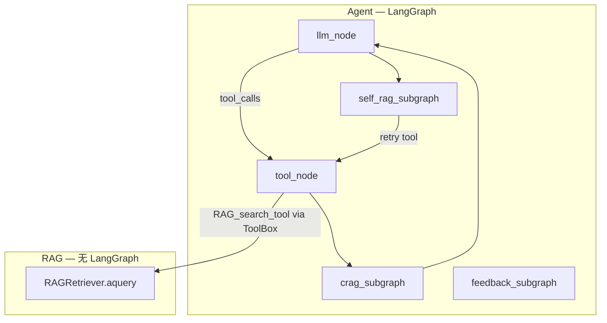

# Agent 反思图设计（CRAG / Self-RAG / Feedback）

> **用途：** 落地 `rag_pattern.md` #11 / #12 / #17 的 Agent 层编排方案。  
> **状态：** 设计稿（反思子图未实现）。建议 **Phase 1 只做 CRAG subgraph**。  
> **RAG 工具层：** 已实现并通过 `tests/tools/test_rag_tool.py` 验证（`bind_*` + `ToolBox.ainvoke`）。

---

## 0. 核心信条（不变）

| 层 | 负责 | 不负责 |
|----|------|--------|
| **RAG** | 给定 query / 文档 → chunk、embed、store、retrieve、rerank | **是否检索**、CRAG 判决、用户反馈 |
| **Agent** | 消息、何时调工具、反思路由、重试与降级 | **向量检索实现细节**（不直接 `aretrieve` / `_run_query`） |

Agent 通过 **ToolBox + `RAG_search_tool`** 触发检索；CRAG / Self-RAG / Feedback 只读写 **`AgentState.metadata`** 与 **条件边**，不嵌入 RAG 编排逻辑。

---

## 1. 设计目标

| 目标 | 做法 |
|------|------|
| RAG 不嵌进子图逻辑 | 检索统一走 `ToolBox` + `RAG_search_tool`；子图用 `tool_box.ainvoke` 或让 LLM 再发 `tool_calls` |
| 反思状态可观测 | 写入 `AgentState.metadata`，不拼进 `messages` 正文 |
| 模式可插拔 | 每个模式 = 外层 1 个 node（内部 subgraph），`build_agent(pattern=...)` 按需挂载 |
| 与现有 ReAct 兼容 | 保留 `llm` → `tools` → `llm`；在 `tools` 与 `llm` 之间插入 `crag_eval` 等 |

---

## 2. 当前基线（仓库现状）

```text
agent/graph.py     build_ReAct_agent(AgentConfig)
                     AgentConfig.tool_box: ToolBox | None
  llm  ──if_tool_calls──►  tools  ──►  llm  ──► END

agent/nodes.py     llm_node(tool_box), tool_node(tool_box)
agent/state.py     AgentState { messages, metadata?, ... }

tools/
  registry.py      @local_tool / @mcp_tool，discover_packages()
  tool_box.py      autodiscover → list_tools() / ainvoke(name, args)
  LocalTool/
    RAG_tool.py    RAG_index_tool, RAG_search_tool + bind_rag_context（旧 bind_indexer / bind_retriever 仍兼容）
    math_tool.py   integrate_function（示例 local tool）
  MCPTool/         markitdown、bocha（bocha = CRAG 预留的 web 兜底，未启用）

rag/
  core.py          RAGIndexer / RAGRetriever（Agent 不直接 import 调用）
  build.py         build_RAG_indexer / build_RAG_retriever + build_retriever_variant / build_indexer_variant

agent/
  reflection/      self_rag.py、feedback.py（普通节点）、parsers.py
  subgraph/        CRAG.py（独立 state 的子图）
```

**RAG 工具可插拔：** `RAG_search_tool` 现暴露查询期开关 `use_hyde` / `use_reranker` / `recall_n` / `top_k`，由 LLM 在绑定时的允许范围内自选；`bind_rag_context` 共享一套 store+embedder 并按组合惰性构建并缓存 retriever 变体。索引耦合项（`use_small_to_big` / `use_contextual`）在绑定时固定，index 与 search 共享。

**索引（aindex）默认不在 Agent 图里：** 建库由脚本 / 离线任务完成；Agent 运行时以 **`RAG_search_tool` 查询** 为主。若 Agent 需要运行时入库，仍通过 **`RAG_index_tool`**（同一 ToolBox 路径），而非在子图里写 `aindex`。

**反思结构：** Self-RAG / Feedback 已摊平为 `agent/reflection/` 下的普通节点，直接在 `graph.py` 用条件边组合；CRAG 是 `agent/subgraph/CRAG.py` 中**带私有 `CragState` 的独立子图**，内部跑「评分 → 换检索变体重试 → （预留）web 兜底 → 定稿」循环，只把合格 context 回写主图 `AgentState`。

---

## 3. 分层职责



| 层 | 负责 | 不负责 |
|----|------|--------|
| **RAG** | chunk、embed、store、retrieve、rerank、contextual | 是否检索、CRAG 判决、用户反馈 |
| **Agent** | 消息、工具调用、反思路由、重试次数 | 向量检索实现细节 |

---

## 4. `AgentState` 扩展

在 `agent/state.py` 的 `metadata` 中约定字段（TypedDict 可选子类型 `AgentMetadata`）：

```python
# 建议：agent/metadata_schema.py 或写在 state.py 注释里

# --- RAG 调用 ---
rag_tool_name: str              # 默认 "RAG_search_tool"
rag_attempt: int                # 当前 thread 内检索次数（含重试）
rag_last_query: str             # 上次传入 RAG_search_tool 的 query
rag_last_raw: str | None        # 上次 ToolMessage 原文（可选，便于 CRAG 解析）

# --- CRAG (#17) ---
crag_verdict: str               # "correct" | "incorrect" | "ambiguous" | "skipped"
crag_labels: list[dict]         # 每条 chunk 的 {index, label, score?}
crag_action: str                # "use" | "requery" | "web_fallback" | "degrade"

# --- Self-RAG (#12) ---
self_rag_need_retrieve: bool | None
self_rag_grounded: bool | None
self_rag_retry_allowed: bool    # 是否允许再搜一轮（防死循环）

# --- Feedback (#11) ---
feedback_detected: bool
feedback_kind: str | None       # "correction" | "thumbs_down" | "clarify"
feedback_suggested_query: str | None
```

**规则：**

- `messages` 只放对话与 **工具返回给模型看的最终文本**（可经 CRAG 裁剪后再写入 ToolMessage）。
- 判决、重试计数、标签列表进 `metadata`，供条件边与日志使用。
- 子图入口从 `state` 读，子图出口 `return {"metadata": {**patch}}`（注意 merge 策略，见 §6）。

---

## 5. RAG 作为工具（禁止子图硬编码检索）

### 5.1 启动方式（应用 bootstrap 一次）

RAG 工具在 `tools/LocalTool/RAG_tool.py` 上用 **`@local_tool`** 声明；**无需手写 `ToolInfo` 列表**。`ToolBox` 启动时 `autodiscover` 扫描 `tools.LocalTool`（或按需缩小 `packages`）。

```python
from tools.LocalTool.RAG_tool import bind_rag_context
from tools.tool_box import ToolBox

# 一次绑定共享 store+embedder + 查询期允许范围；index/search 共用固定的索引耦合项
bind_rag_context(
    collection="my_kb",
    in_memory=True,
    use_small_to_big=False,   # 索引耦合项，绑定时固定
    use_contextual=False,
    allow_hyde=True,          # 允许 LLM 运行时开 HyDE
    allow_reranker=True,      # 允许 LLM 运行时开精排
    default_top_k=5,
    max_recall_n=50,
)

# 默认 autodiscover LocalTool + MCPTool；若 Agent 只需 RAG，可收窄 packages
tool_box = ToolBox(
    autodiscover=True,
    packages=("tools.LocalTool",),  # 或 ("tools.LocalTool.RAG_tool",)
)

# 已注册工具名（由 @local_tool 函数名决定）：
#   RAG_index_tool, RAG_search_tool, integrate_function, ...
```

与 `FRAMEWORK_DESIGN.md` 一致：**LLM 通过 tool_calls 触发检索**；`tool_node` 执行 `tool_box.ainvoke("RAG_search_tool", {"query": ..., "use_reranker": True})`。旧的 `bind_indexer` / `bind_retriever`（绑定预构建对象）仍兼容，但不支持运行时切换查询期开关。

**绑定必须在首次检索前完成**；未绑定时工具返回可读错误字符串（不抛异常）。被允许范围外的开关请求会被回退并在结果尾部追加 `[note] ...` 提示。

### 5.2 子图内「重搜」的两种合法方式

| 方式 | 适用 | 说明 |
|------|------|------|
| **A. 回到 `llm`，让模型再调工具** | 纯聊天 / 不需重搜 | 节点只改 `metadata` 提示，下一跳 `llm` 后再 `tool_calls` |
| **B. 子图内直接 `tool_box.ainvoke`（CRAG 当前实现）** | CRAG 明确重搜 | CRAG 子图在私有 `CragState` 内按升级阶梯调 **同一个** `RAG_search_tool`（如 `use_reranker` → `use_hyde`），重评分；只把定稿合格 context 回写主图、改写最后一条 RAG `ToolMessage` |

**禁止：**

```python
# 不要在 agent/ 里写
from rag.core import RAGRetriever
await retriever.aquery(...)         # 绕过 ToolBox
await indexer.aindex(...)             # 绕过 ToolBox（除非封装进 RAG_index_tool 再 ainvoke）
# 复制 rag 内部编排（HyDE、rerank 路由等）到 agent/
```

**推荐封装（可选薄函数）：**

```python
# agent/rag_tool.py
from tools.tool_box import ToolBox, ToolResult

async def invoke_rag_tool(
    tool_box: ToolBox,
    *,
    query: str,
    tool_name: str = "RAG_search_tool",
) -> ToolResult:
    return await tool_box.ainvoke(tool_name, {"query": query})
```

子图 B 模式只调 `invoke_rag_tool`，仍走 ToolBox，**不在 agent 层 import `RAGRetriever`**。

### 5.3 与 `rag/core.py` 的关系

| 场景 | 用谁 |
|------|------|
| 离线建库 | `build_RAG_indexer` → `bind_rag_context` → `RAG_index_tool` 或脚本直接 `aindex` |
| Agent 运行时检索 | `bind_rag_context` → `RAG_search_tool`（经 `ToolBox`，查询期开关运行时可选） |
| 单元 / 集成测试 | `tests/tools/test_rag_tool.py`（InMemoryVectorStore + MockEmbedder） |

`RAGIndexer.as_tool()` / `RAGRetriever.as_tool()` 若仍保留，仅作脚本/helper；**反思图与 ReAct Agent 路径统一走 `RAG_tool.py`**。

---

## 6. 外层图：ReAct + 反思节点

### 6.1 Phase 1（建议先做）

只加 **CRAG**，边：`tools` → `crag_eval` → `llm`。

```text
entry: llm
  llm ──conditional──► tools | END
  tools ──► crag_eval
  crag_eval ──conditional──► llm | tools | END
```

`crag_eval` 内部是 subgraph（§7）。  
条件边示例：

- `crag_action == "requery"` 且 `rag_attempt < max` → `tools`（B 模式）或 `llm`（A 模式）
- 否则 → `llm`

### 6.2 Phase 2 / 3

| Phase | 新增 node | 位置 |
|-------|-----------|------|
| 2 | `self_rag_pre` | `llm` 之前（是否允许 tool） |
| 2 | `self_rag_post` | 最终回答之后（grounded？） |
| 3 | `feedback` | 检测到用户纠错意图时（新用户消息后） |

每个 node = `StateGraph.compile()` 的子图，用 `graph.add_node("crag_eval", crag_subgraph)` 挂载。

### 6.3 metadata 合并

LangGraph 默认 **浅合并** `metadata`。建议：

- 子图节点返回 **局部 patch**：`{"metadata": {"crag_verdict": "incorrect", "rag_attempt": state["metadata"].get("rag_attempt", 0) + 1}}`
- 或实现 `agent/reducers.py` 里 `merge_metadata` reducer（若改为 Annotated 字段）。

---

## 7. CRAG subgraph 详细设计（Phase 1）

对应 `rag_pattern.md` #17：**检索后、生成前** 评估证据质量。

### 7.1 子图状态

可与 `AgentState` 相同（子图共享父 state），或定义 `CragState` 继承/嵌套 `messages` + `metadata`。

### 7.2 节点列表

```text
crag_entry
  → extract_rag_context     # 从最后一条 ToolMessage 取 rag_last_raw（metadata 备份）
  → score_relevance         # LLM / 小模型：每条 passage correct|incorrect|ambiguous
  → route_verdict           # 聚合为 overall verdict + crag_action
  → [requery] prepare_requery   # 写 metadata.rag_last_query、rag_attempt++
  → [requery] invoke_rag_tool   # 可选 B 模式
  → [use] trim_context          # 只保留 correct 段落，写回 ToolMessage 或 metadata
  → crag_exit
```

### 7.3 路由表

| overall | `crag_action` | 下一跳（父图） |
|---------|---------------|----------------|
| 全部 correct | `use` | `llm` |
| 存在 incorrect | `requery` 或 `web_fallback` | `tools` / 外部搜索（roadmap，如 `bocha` MCP） |
| 以 ambiguous 为主 | `requery` 或 `degrade`（少用上下文直接答） | `llm` + 降级 prompt |

**重试上限：** `metadata.rag_attempt >= 2` 时强制 `crag_action = "use"` 或 `degrade`，防止环。

### 7.4 不调用 RAG 的情况

若上一轮 **没有** `RAG_search_tool` 的 ToolMessage（例如纯聊天），`crag_eval` 应 **skip**：

```python
metadata["crag_verdict"] = "skipped"
# 父图 conditional 直接 → llm
```

---

## 8. Self-RAG subgraph 概要（Phase 2）

| 子图 | 时机 | 关键 metadata |
|------|------|----------------|
| `self_rag_pre` | 用户提问后、首次 `llm` 前 | `self_rag_need_retrieve` |
| `self_rag_post` | `llm` 输出无 tool_calls 后 | `self_rag_grounded` |

- **检索决策：** 由 LLM 通过 ReAct `tool_calls` 触发（RAG 层不参与决策）；`self_rag_pre` 仅加 **规则/轻量分类**（可选）。
- **Grounded 检查：** 对比 `metadata.rag_last_raw` 与最后一条 AIMessage；不通过且 `self_rag_retry_allowed` → 父图指回 `tools`（仍经 `RAG_search_tool` / `invoke_rag_tool`）。

---

## 9. Feedback subgraph 概要（Phase 3）

触发：新 `HumanMessage` 含纠错意图（关键词 / 小模型分类）。

```text
detect_feedback → plan（再搜 / 重写 / 追问）→ 更新 metadata.feedback_*
  → 若再搜：invoke_rag_tool 或 END→llm 带新 query
```

反馈 **优先** 改 `metadata.feedback_suggested_query`，由 LLM 在下一轮发起 tool_calls，与「用户说不对」产品流程一致。**Feedback 判决在 Agent 层，不在 RAG 层。**

---

## 10. 推荐目录结构

```text
agent/
  state.py                 # AgentState + AgentMetadata 文档
  graph.py                 # build_ReAct_agent, build_agent(pattern=...)
  nodes.py                 # llm_node, tool_node（注入 tool_box）
  rag_tool.py              # invoke_rag_tool（薄封装，可选）
  metadata_schema.py       # TypedDict 可选
  subgraph/                # 占位 → 实现为 CompiledGraph
    CRAG.py
    Self_RAG.py
    RAG_FeedBack.py
  reflection/              # 或统一收拢到此包（与 subgraph/ 二选一，避免重复）
    crag_graph.py
    self_rag_graph.py
    feedback_graph.py
    parsers.py             # 从 ToolMessage 解析 chunk 文本

tools/LocalTool/RAG_tool.py   # @local_tool + bind_*（已实现）
tests/tools/test_rag_tool.py  # RAG 工具层回归
```

---

## 11. 工具返回格式（建议演进）

当前 `RAG_search_tool` 返回 **纯文本**（`---` 分隔），CRAG 解析略脆。可选演进：

| 阶段 | 格式 | CRAG |
|------|------|------|
| 现况 | 多段 string | 按 `---` split + LLM 打分 |
| 改进 | `RAG_search_tool` 增加 `format="json"` 返回 `[{content, score, metadata}]` | 结构化 `crag_labels` |

**索引与查询分离不变**；仅改 tool **输出序列化**，实现仍在 `RAGRetriever` / `RAG_tool.py`，不在 CRAG 子图里拼 chunk。

---

## 12. 实现检查清单

### 已 done — RAG 工具层

- [x] `tools/LocalTool/RAG_tool.py`：`@local_tool` + `bind_indexer` / `bind_retriever`
- [x] `ToolBox` autodiscover + `ainvoke`（`agent/nodes.py` 已接入）
- [x] `tests/tools/test_rag_tool.py`：bind、index、search、ToolBox 全流程

### Phase 1 — CRAG

- [ ] `AgentState.metadata` 字段约定 + `metadata_schema.py`
- [ ] `agent/rag_tool.py`：`invoke_rag_tool`（可选）
- [ ] `reflection/crag_graph.py` 或 `subgraph/CRAG.py`：子图 + `build_crag_subgraph`
- [ ] `graph.py`：`tools` → `crag_eval` → conditional → `llm` / `tools`
- [ ] `rag_attempt` 上限与 `crag_verdict == skipped` 逻辑
- [ ] 单测：mock `tool_box`，无真实 Qdrant

### Phase 2 — Self-RAG

- [ ] `self_rag_post` 子图 + grounded 提示词
- [ ] 与 CRAG 共用 `rag_attempt` 上限

### Phase 3 — Feedback

- [ ] 用户消息意图检测 + `feedback_*` metadata

### 集成

- [ ] 启动脚本：`build_RAG_retriever` + `bind_retriever` + `ToolBox(packages=...)`
- [ ] `build_agent(pattern="react_crag")` feature flag

---

## 13. 反模式（避免）

1. 在 `agent/subgraph/` 或 `agent/reflection/` 里 `from rag.core import RAGRetriever` 并直接 `aquery` / `aindex`。
2. 把 `crag_verdict` 拼进 `HumanMessage` 让模型「读心」。
3. CRAG / Self-RAG / Feedback 三个子图互相硬编码调用；应只通过 **父图 conditional edges** 组合。
4. 无 `rag_attempt` 上限导致 `tools` ↔ `crag_eval` 死循环。
5. 让 RAG 模块读取 `crag_verdict` / `feedback_*`（**反思状态只属于 Agent metadata**）。

---

## 14. 与 `rag_pattern.md` 的对应

| ID | 外层 node | 子图 | RAG 调用 |
|----|-----------|------|----------|
| 17 CRAG | `crag_eval` | §7 | `invoke_rag_tool` 或 回 `llm` 再 tool_calls |
| 12 Self-RAG | `self_rag_pre` / `self_rag_post` | §8 | 同上 |
| 11 Feedback | `feedback` | §9 | 同上 |

---

## 15. 下一步建议（执行顺序）

1. 扩展 `agent/state.py` 注释或 `metadata_schema.py`。
2. 实现 `build_crag_subgraph` + 接入 `build_ReAct_agent`（`enable_crag=True`）。
3. 用固定 ToolMessage fixture 单测 CRAG 路由（mock `tool_box`）。
4. 再考虑 `RAG_search_tool` JSON 输出，降低 CRAG 解析成本。

若 Phase 1 验收通过，再在 `build_agent(pattern="react_crag")` 中默认打开 CRAG 边。
