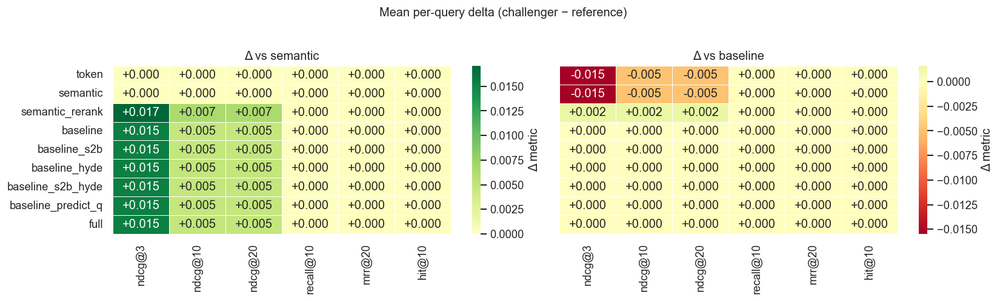
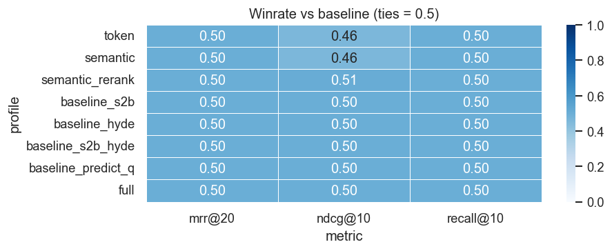
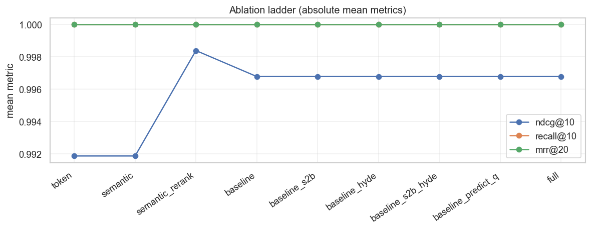
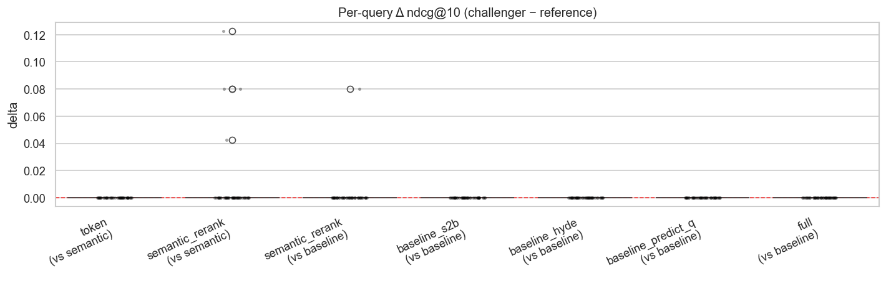
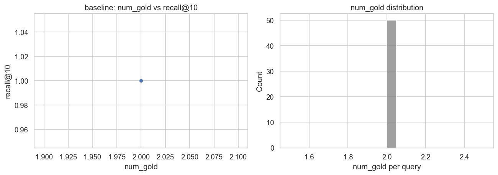

# HotpotQA — 检索 ablation

← [报告索引](./README.md) · [指标说明](./metrics.md)

分析 notebook：[`legacy/_eval_/analysis/visual/hotpotqa.ipynb`](../../legacy/_eval_/analysis/visual/hotpotqa.ipynb)

---

## 实验设置

| 项 | 值 |
|----|-----|
| 结果文件 | `legacy/_eval_/results/hotpotqa_20260620T163446.json` |
| Queries | 50 |
| `k_values` | 3, 10, 20 |
| `rel_threshold` | 1 |
| `max_distractors_per_query` | 100 |
| `chunk_fetch_multiplier` | 4（fetch 80 chunks → doc 去重） |
| 参考 profile（Δ / winrate） | `baseline` |
| Chunker 参考（部分 Δ pair） | `semantic` |

Profiles（本 run）：`token`, `semantic`, `semantic_rerank`, `baseline`, `baseline_s2b`, `baseline_hyde`, `baseline_s2b_hyde`, `baseline_predict_q`（notebook 另有 `full`，下表未包含时可自行补行）。

---

## 1. Mean metrics（绝对值）

| profile | recall@3 | ndcg@3 | hit@3 | recall@10 | ndcg@10 | hit@10 | recall@20 | ndcg@20 | hit@20 | mrr@20 | docs |
|---------|----------|--------|-------|-----------|---------|--------|-----------|---------|--------|--------|------|
| token | 0.98 | 0.981 | 1.0 | 1.0 | 0.992 | 1.0 | 1.0 | 0.992 | 1.0 | 1.0 | 100 |
| semantic | 0.98 | 0.981 | 1.0 | 1.0 | 0.992 | 1.0 | 1.0 | 0.992 | 1.0 | 1.0 | 100 |
| semantic_rerank | 1.00 | 0.998 | 1.0 | 1.0 | 0.998 | 1.0 | 1.0 | 0.998 | 1.0 | 1.0 | 100 |
| baseline | 1.00 | 0.997 | 1.0 | 1.0 | 0.997 | 1.0 | 1.0 | 0.997 | 1.0 | 1.0 | 100 |
| baseline_s2b | 1.00 | 0.997 | 1.0 | 1.0 | 0.997 | 1.0 | 1.0 | 0.997 | 1.0 | 1.0 | 100 |
| baseline_hyde | 1.00 | 0.997 | 1.0 | 1.0 | 0.997 | 1.0 | 1.0 | 0.997 | 1.0 | 1.0 | 100 |
| baseline_s2b_hyde | 1.00 | 0.997 | 1.0 | 1.0 | 0.997 | 1.0 | 1.0 | 0.997 | 1.0 | 1.0 | 100 |
| baseline_predict_q | 1.00 | 0.997 | 1.0 | 1.0 | 0.997 | 1.0 | 1.0 | 0.997 | 1.0 | 1.0 | 100 |

`docs` = 该 profile 索引的 pool 文档数（`num_docs_indexed`）。

---

## 2. Δ heatmap vs reference profiles

Notebook §2。Δ = **challenger − reference**（绿/正 = challenger 更好）。

---

## 3. Winrate vs `baseline`

Notebook §3。指标：`ndcg@10`, `mrr@20`, `recall@10`；tie 计 0.5。

| profile |             metric |   winrate | wins | losses | ties |      |
| ------: | -----------------: | --------: | ---: | -----: | ---: | ---- |
|       8 |              token |    mrr@20 | 0.50 |      0 |    0 | 50   |
|       9 |           semantic |    mrr@20 | 0.50 |      0 |    0 | 50   |
|      10 |    semantic_rerank |    mrr@20 | 0.50 |      0 |    0 | 50   |
|      11 |       baseline_s2b |    mrr@20 | 0.50 |      0 |    0 | 50   |
|      12 |      baseline_hyde |    mrr@20 | 0.50 |      0 |    0 | 50   |
|      13 |  baseline_s2b_hyde |    mrr@20 | 0.50 |      0 |    0 | 50   |
|      14 | baseline_predict_q |    mrr@20 | 0.50 |      0 |    0 | 50   |
|      15 |               full |    mrr@20 | 0.50 |      0 |    0 | 50   |
|       2 |    semantic_rerank |   ndcg@10 | 0.51 |      1 |    0 | 49   |
|       3 |       baseline_s2b |   ndcg@10 | 0.50 |      0 |    0 | 50   |
|       4 |      baseline_hyde |   ndcg@10 | 0.50 |      0 |    0 | 50   |
|       5 |  baseline_s2b_hyde |   ndcg@10 | 0.50 |      0 |    0 | 50   |
|       6 | baseline_predict_q |   ndcg@10 | 0.50 |      0 |    0 | 50   |
|       7 |               full |   ndcg@10 | 0.50 |      0 |    0 | 50   |
|       0 |              token |   ndcg@10 | 0.46 |      0 |    4 | 46   |
|       1 |           semantic |   ndcg@10 | 0.46 |      0 |    4 | 46   |
|      16 |              token | recall@10 | 0.50 |      0 |    0 | 50   |
|      17 |           semantic | recall@10 | 0.50 |      0 |    0 | 50   |
|      18 |    semantic_rerank | recall@10 | 0.50 |      0 |    0 | 50   |
|      19 |       baseline_s2b | recall@10 | 0.50 |      0 |    0 | 50   |
|      20 |      baseline_hyde | recall@10 | 0.50 |      0 |    0 | 50   |
|      21 |  baseline_s2b_hyde | recall@10 | 0.50 |      0 |    0 | 50   |
|      22 | baseline_predict_q | recall@10 | 0.50 |      0 |    0 | 50   |
|      23 |               full | recall@10 | 0.50 |      0 |    0 | 50   |

---

## 4. Ablation ladder

Notebook §4。沿 `ABLATION_ORDER` 画 `ndcg@10` / `recall@10` / `mrr@20` 绝对均值曲线。

---

## 5. Per-query Δ distribution

Notebook §5。选定 profile pair 的 per-query Δ 分布（如 `semantic_rerank − baseline`）。

## . Paired t-test（`baseline` ablations)

Notebook §6。相对 `baseline` 的 paired t-test（需 `scipy` 才有 p-value）。

| reference | challenger |             metric |       n | mean_delta | std_delta | t_stat | p_value |        |
| --------: | ---------: | -----------------: | ------: | ---------: | --------: | -----: | ------: | ------ |
|         0 |   semantic |              token | ndcg@10 |         50 |    0.0000 | 0.0000 |    0.00 | NaN    |
|         1 |   semantic |              token |  mrr@20 |         50 |    0.0000 | 0.0000 |    0.00 | NaN    |
|         2 |   semantic |    semantic_rerank | ndcg@10 |         50 |    0.0065 | 0.0238 |    1.94 | 0.0582 |
|         3 |   semantic |    semantic_rerank |  mrr@20 |         50 |    0.0000 | 0.0000 |    0.00 | NaN    |
|         4 |   baseline |    semantic_rerank | ndcg@10 |         50 |    0.0016 | 0.0114 |    1.00 | 0.3222 |
|         5 |   baseline |    semantic_rerank |  mrr@20 |         50 |    0.0000 | 0.0000 |    0.00 | NaN    |
|         6 |   baseline |       baseline_s2b | ndcg@10 |         50 |    0.0000 | 0.0000 |    0.00 | NaN    |
|         7 |   baseline |       baseline_s2b |  mrr@20 |         50 |    0.0000 | 0.0000 |    0.00 | NaN    |
|         8 |   baseline |      baseline_hyde | ndcg@10 |         50 |    0.0000 | 0.0000 |    0.00 | NaN    |
|         9 |   baseline |      baseline_hyde |  mrr@20 |         50 |    0.0000 | 0.0000 |    0.00 | NaN    |
|        10 |   baseline | baseline_predict_q | ndcg@10 |         50 |    0.0000 | 0.0000 |    0.00 | NaN    |
|        11 |   baseline | baseline_predict_q |  mrr@20 |         50 |    0.0000 | 0.0000 |    0.00 | NaN    |
|        12 |   baseline |               full | ndcg@10 |         50 |    0.0000 | 0.0000 |    0.00 | NaN    |
|        13 |   baseline |               full |  mrr@20 |         50 |    0.0000 | 0.0000 |    0.00 | NaN    |

---

## 7. Diagnostic: `num_gold` vs recall

Notebook §7。按每条 query 的 gold 文档数分桶，看 recall 是否随 `num_gold` 变差。

| num_gold | recall@10 | hit@10 |      |
| -------: | --------: | -----: | ---- |
|    count |      50.0 |   50.0 | 50.0 |
|     mean |       2.0 |    1.0 | 1.0  |
|      std |       0.0 |    0.0 | 0.0  |
|      min |       2.0 |    1.0 | 1.0  |
|      25% |       2.0 |    1.0 | 1.0  |
|      50% |       2.0 |    1.0 | 1.0  |
|      75% |       2.0 |    1.0 | 1.0  |
|      max |       2.0 |    1.0 | 1.   |

---

## 8. 解读（待写）

<!-- 复制 notebook §8 checklist，或自行总结 -->

- [ ] 主指标 **nDCG@10**：谁最好？与 `semantic_rerank` / `baseline` 差多少？
- [ ] **Recall@10**：多 gold（HotpotQA 常见）是否已打满？若 recall@3 < recall@10，说明深检索仍有用。
- [ ] **MRR@20** 是否已饱和（≈1.0）？饱和时 profile 差异主要看 nDCG 细排。
- [ ] Production 向 ablation（s2b / hyde / predict_q）相对 `baseline` 的 Δ 是否值得复杂度？
- [ ] 局限：pooled subset、doc-level 去重、不评生成质量。

---

*数据：`results[].mean_metrics` · 图表：`assets/hotpotqa/*.png`*
