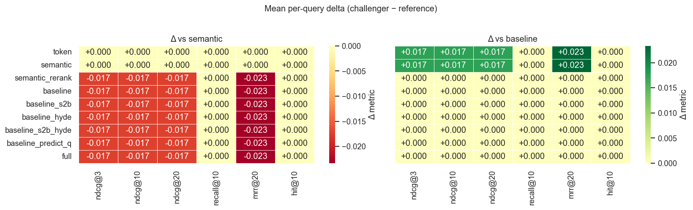
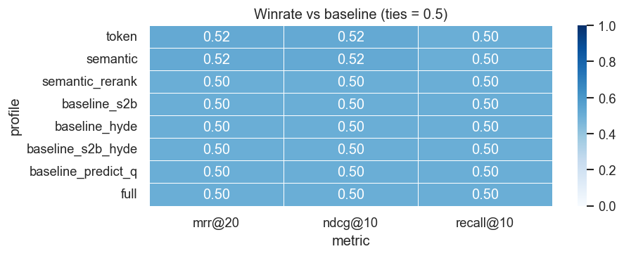
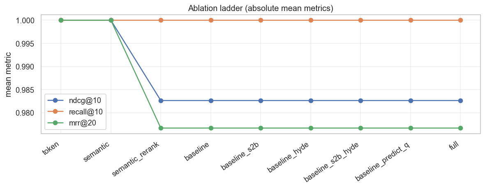
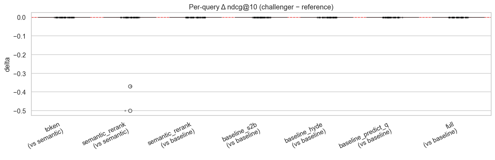
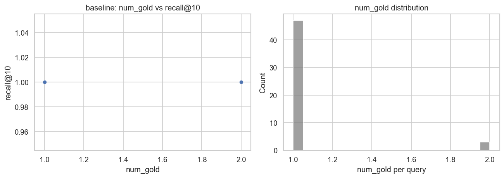

# MS MARCO — 检索 ablation

← [报告索引](./README.md) · [指标说明](./metrics.md)

分析 notebook：[`legacy/_eval_/analysis/visual/msmarco.ipynb`](../../legacy/_eval_/analysis/visual/msmarco.ipynb)

配置：[`legacy/_eval_/configs/rag_eval_arg_config_msmarco.yaml`](../../legacy/_eval_/configs/rag_eval_arg_config_msmarco.yaml)

---

## 实验设置

| 项 | 值 |
|----|-----|
| 结果文件 | `legacy/_eval_/results/msmarco_<timestamp>.json` |
| Queries | |
| `k_values` | 3, 10, 20 |
| `rel_threshold` | 1 |
| `max_distractors_per_query` | |
| 参考 profile | `baseline` |

---

## 1. Mean metrics（绝对值）

| profile |      | recall@3 | ndcg@3 | hit@3 | recall@10 | ndcg@10 | hit@10 | recall@20 | ndcg@20 | hit@20 | mrr@20 |
|---------|----------|--------|-------|-----------|---------|--------|-----------|---------|--------|--------|------|
| token              | 1.0  | 1.000    | 1.0    | 1.0   | 1.000     | 1.0     | 1.0    | 1.000     | 1.0     | 1.000  | 53     |
| semantic           | 1.0  | 1.000    | 1.0    | 1.0   | 1.000     | 1.0     | 1.0    | 1.000     | 1.0     | 1.000  | 53     |
| semantic_rerank    | 1.0  | 0.983    | 1.0    | 1.0   | 0.983     | 1.0     | 1.0    | 0.983     | 1.0     | 0.977  | 53     |
| baseline           | 1.0  | 0.983    | 1.0    | 1.0   | 0.983     | 1.0     | 1.0    | 0.983     | 1.0     | 0.977  | 53     |
| baseline_s2b       | 1.0  | 0.983    | 1.0    | 1.0   | 0.983     | 1.0     | 1.0    | 0.983     | 1.0     | 0.977  | 53     |
| baseline_hyde      | 1.0  | 0.983    | 1.0    | 1.0   | 0.983     | 1.0     | 1.0    | 0.983     | 1.0     | 0.977  | 53     |
| baseline_s2b_hyde  | 1.0  | 0.983    | 1.0    | 1.0   | 0.983     | 1.0     | 1.0    | 0.983     | 1.0     | 0.977  | 53     |
| baseline_predict_q | 1.0  | 0.983    | 1.0    | 1.0   | 0.983     | 1.0     | 1.0    | 0.983     | 1.0     | 0.977  | 53     |
| full               | 1.0  | 0.983    | 1.0    | 1.0   | 0.983     | 1.0     | 1.0    | 0.983     | 1.0     | 0.977  | 53     |

---

## 2. Δ heatmap vs reference profiles

---

## 3. Winrate vs `baseline`

---

## 4. Ablation ladder

---

## 5. Per-query Δ distribution

---

## 6. Paired t-test（`baseline` ablations）

|      | reference |         challenger |  metric |    n | mean_delta | std_delta |  t_stat | p_value |
| ---: | --------: | -----------------: | ------: | ---: | ---------: | --------: | ------: | ------: |
|    0 |  semantic |              token | ndcg@10 |   50 |     0.0000 |    0.0000 |  0.0000 |     NaN |
|    1 |  semantic |              token |  mrr@20 |   50 |     0.0000 |    0.0000 |  0.0000 |     NaN |
|    2 |  semantic |    semantic_rerank | ndcg@10 |   50 |    -0.0174 |    0.0870 | -1.4123 |  0.1642 |
|    3 |  semantic |    semantic_rerank |  mrr@20 |   50 |    -0.0233 |    0.1167 | -1.4139 |  0.1637 |
|    4 |  baseline |    semantic_rerank | ndcg@10 |   50 |     0.0000 |    0.0000 |  0.0000 |     NaN |
|    5 |  baseline |    semantic_rerank |  mrr@20 |   50 |     0.0000 |    0.0000 |  0.0000 |     NaN |
|    6 |  baseline |       baseline_s2b | ndcg@10 |   50 |     0.0000 |    0.0000 |  0.0000 |     NaN |
|    7 |  baseline |       baseline_s2b |  mrr@20 |   50 |     0.0000 |    0.0000 |  0.0000 |     NaN |
|    8 |  baseline |      baseline_hyde | ndcg@10 |   50 |     0.0000 |    0.0000 |  0.0000 |     NaN |
|    9 |  baseline |      baseline_hyde |  mrr@20 |   50 |     0.0000 |    0.0000 |  0.0000 |     NaN |
|   10 |  baseline | baseline_predict_q | ndcg@10 |   50 |     0.0000 |    0.0000 |  0.0000 |     NaN |
|   11 |  baseline | baseline_predict_q |  mrr@20 |   50 |     0.0000 |    0.0000 |  0.0000 |     NaN |
|   12 |  baseline |               full | ndcg@10 |   50 |     0.0000 |    0.0000 |  0.0000 |     NaN |
|   13 |  baseline |               full |  mrr@20 |   50 |     0.0000 |    0.0000 |  0.0000 |     NaN |

---

## 7. Diagnostic: `num_gold` vs recall

|       | num_gold | recall@10 | hit@10 |
| ----: | -------: | --------: | -----: |
| count |    50.00 |      50.0 |   50.0 |
|  mean |     1.06 |       1.0 |    1.0 |
|   std |     0.24 |       0.0 |    0.0 |
|   min |     1.00 |       1.0 |    1.0 |
|   25% |     1.00 |       1.0 |    1.0 |
|   50% |     1.00 |       1.0 |    1.0 |
|   75% |     1.00 |       1.0 |    1.0 |
|   max |     2.00 |       1.0 |    1.0 |

---

## 8. 解读（待写）

- [ ] …
