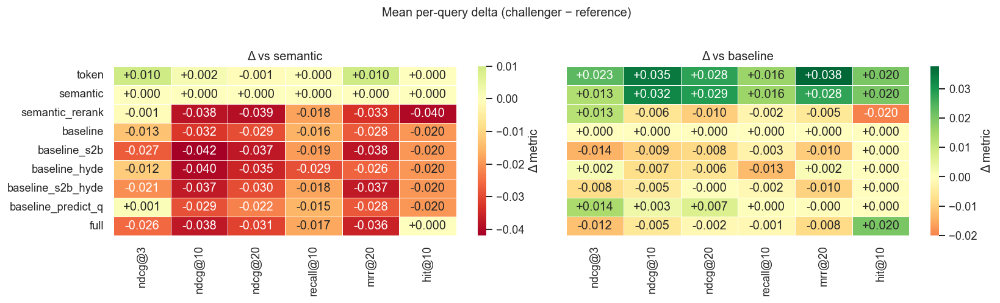
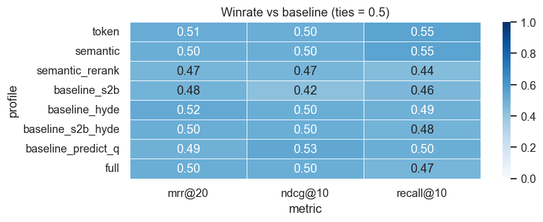
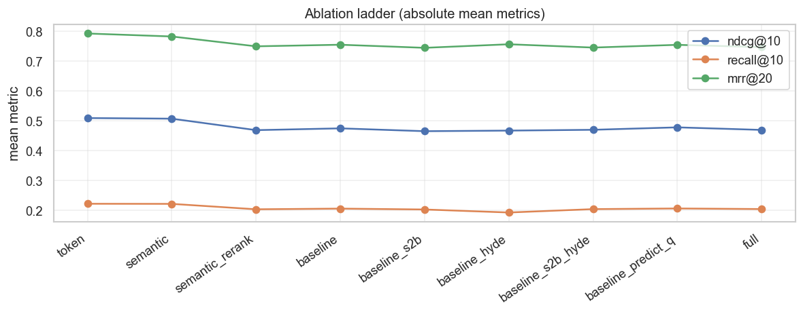
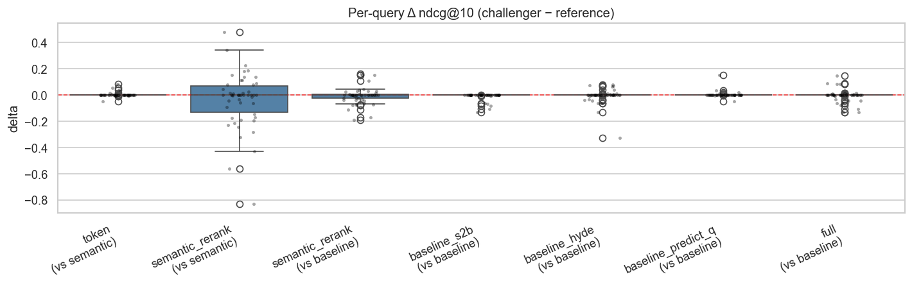
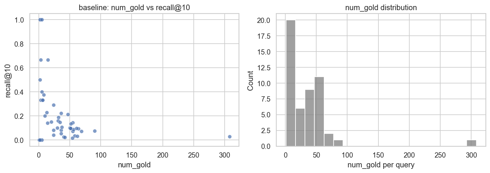

# NFCorpus — 检索 ablation

← [报告索引](./README.md) · [指标说明](./metrics.md)

分析 notebook：[`legacy/_eval_/analysis/visual/nfcorpus.ipynb`](../../legacy/_eval_/analysis/visual/nfcorpus.ipynb)

---

## 实验设置

| 项 | 值 |
|----|-----|
| 结果文件 | `legacy/_eval_/results/nfcorpus_<timestamp>.json` |
| Queries | <!-- query_limit --> |
| `k_values` | 3, 10, 20 |
| `rel_threshold` | 1 |
| `max_distractors_per_query` | 100 |
| 参考 profile | `baseline` |

---

## 1. Mean metrics（绝对值）

| profile | recall@3 | ndcg@3 | hit@3 | recall@10 | ndcg@10 | hit@10 | recall@20 | ndcg@20 | hit@20 | mrr@20 | docs |
|---------|----------|--------|-------|-----------|---------|--------|-----------|---------|--------|--------|------|
| token              | 0.139    | 0.593  | 0.80  | 0.222     | 0.509   | 0.90   | 0.279     | 0.472   | 0.94   | 0.792  | 1047 |
| semantic           | 0.138    | 0.583  | 0.80  | 0.221     | 0.507   | 0.90   | 0.280     | 0.473   | 0.94   | 0.783  | 1047 |
| semantic_rerank    | 0.139    | 0.582  | 0.80  | 0.203     | 0.469   | 0.86   | 0.249     | 0.434   | 0.88   | 0.750  | 1047 |
| baseline           | 0.132    | 0.569  | 0.82  | 0.205     | 0.474   | 0.88   | 0.263     | 0.444   | 0.88   | 0.755  | 1047 |
| baseline_s2b       | 0.130    | 0.555  | 0.82  | 0.203     | 0.465   | 0.88   | 0.260     | 0.436   | 0.88   | 0.745  | 1047 |
| baseline_hyde      | 0.132    | 0.571  | 0.82  | 0.192     | 0.467   | 0.88   | 0.253     | 0.438   | 0.90   | 0.756  | 1047 |
| baseline_s2b_hyde  | 0.131    | 0.562  | 0.82  | 0.204     | 0.470   | 0.88   | 0.263     | 0.444   | 0.88   | 0.745  | 1047 |
| baseline_predict_q | 0.143    | 0.584  | 0.82  | 0.206     | 0.478   | 0.88   | 0.265     | 0.451   | 0.88   | 0.755  | 1047 |
| full               | 0.130    | 0.557  | 0.82  | 0.204     | 0.469   | 0.90   | 0.260     | 0.442   | 0.90   | 0.747  | 1047 |

---

## 2. Δ heatmap vs reference profiles

---

## 3. Winrate vs `baseline`

| profile |             metric |   winrate | wins | losses | ties |      |
| ------: | -----------------: | --------: | ---: | -----: | ---: | ---- |
|      12 |      baseline_hyde |    mrr@20 | 0.52 |      2 |    0 | 48   |
|       8 |              token |    mrr@20 | 0.51 |      6 |    5 | 39   |
|       9 |           semantic |    mrr@20 | 0.50 |      6 |    6 | 38   |
|      13 |  baseline_s2b_hyde |    mrr@20 | 0.50 |      1 |    1 | 48   |
|      15 |               full |    mrr@20 | 0.50 |      1 |    1 | 48   |
|      14 | baseline_predict_q |    mrr@20 | 0.49 |      0 |    1 | 49   |
|      11 |       baseline_s2b |    mrr@20 | 0.48 |      0 |    2 | 48   |
|      10 |    semantic_rerank |    mrr@20 | 0.47 |      2 |    5 | 43   |
|       6 | baseline_predict_q |   ndcg@10 | 0.53 |      5 |    2 | 43   |
|       0 |              token |   ndcg@10 | 0.50 |     19 |   19 | 12   |
|       1 |           semantic |   ndcg@10 | 0.50 |     19 |   19 | 12   |
|       4 |      baseline_hyde |   ndcg@10 | 0.50 |      9 |    9 | 32   |
|       5 |  baseline_s2b_hyde |   ndcg@10 | 0.50 |     10 |   10 | 30   |
|       7 |               full |   ndcg@10 | 0.50 |     11 |   11 | 28   |
|       2 |    semantic_rerank |   ndcg@10 | 0.47 |     14 |   17 | 19   |
|       3 |       baseline_s2b |   ndcg@10 | 0.42 |      0 |    8 | 42   |
|      16 |              token | recall@10 | 0.55 |     17 |   12 | 21   |
|      17 |           semantic | recall@10 | 0.55 |     17 |   12 | 21   |
|      22 | baseline_predict_q | recall@10 | 0.50 |      1 |    1 | 48   |
|      20 |      baseline_hyde | recall@10 | 0.49 |      5 |    6 | 39   |
|      21 |  baseline_s2b_hyde | recall@10 | 0.48 |      4 |    6 | 40   |
|      23 |               full | recall@10 | 0.47 |      4 |    7 | 39   |
|      19 |       baseline_s2b | recall@10 | 0.46 |      0 |    4 | 46   |
|      18 |    semantic_rerank | recall@10 | 0.44 |      4 |   10 | 36   |

---

## 4. Ablation ladder

---

## 5. Per-query Δ distribution

## 6. Paired t-test（`baseline` ablations)

| reference | challenger |             metric |       n | mean_delta | std_delta | t_stat | p_value |        |
| --------: | ---------: | -----------------: | ------: | ---------: | --------: | -----: | ------: | ------ |
|         0 |   semantic |              token | ndcg@10 |         50 |    0.0021 | 0.0166 |  0.9101 | 0.3672 |
|         1 |   semantic |              token |  mrr@20 |         50 |    0.0100 | 0.0707 |  0.9957 | 0.3243 |
|         2 |   semantic |    semantic_rerank | ndcg@10 |         50 |   -0.0384 | 0.2127 | -1.2766 | 0.2078 |
|         3 |   semantic |    semantic_rerank |  mrr@20 |         50 |   -0.0330 | 0.2757 | -0.8467 | 0.4013 |
|         4 |   baseline |    semantic_rerank | ndcg@10 |         50 |   -0.0060 | 0.0639 | -0.6588 | 0.5131 |
|         5 |   baseline |    semantic_rerank |  mrr@20 |         50 |   -0.0053 | 0.1404 | -0.2695 | 0.7887 |
|         6 |   baseline |       baseline_s2b | ndcg@10 |         50 |   -0.0095 | 0.0290 | -2.3137 | 0.0249 |
|         7 |   baseline |       baseline_s2b |  mrr@20 |         50 |   -0.0104 | 0.0707 | -1.0358 | 0.3054 |
|         8 |   baseline |      baseline_hyde | ndcg@10 |         50 |   -0.0075 | 0.0564 | -0.9397 | 0.3520 |
|         9 |   baseline |      baseline_hyde |  mrr@20 |         50 |    0.0015 | 0.0081 |  1.3335 | 0.1885 |
|        10 |   baseline | baseline_predict_q | ndcg@10 |         50 |    0.0034 | 0.0234 |  1.0271 | 0.3094 |
|        11 |   baseline | baseline_predict_q |  mrr@20 |         50 |   -0.0004 | 0.0025 | -1.0000 | 0.3222 |
|        12 |   baseline |               full | ndcg@10 |         50 |   -0.0052 | 0.0470 | -0.7850 | 0.4362 |
|        13 |   baseline |               full |  mrr@20 |         50 |   -0.0080 | 0.0724 | -0.7814 | 0.4383 |

---

## 7. Diagnostic: `num_gold` vs recall

| num_gold | recall@10 | hit@10 |        |
| -------: | --------: | -----: | ------ |
|    count |    50.000 | 50.000 | 50.000 |
|     mean |    34.780 |  0.205 | 0.880  |
|      std |    45.789 |  0.256 | 0.328  |
|      min |     1.000 |  0.000 | 0.000  |
|      25% |     5.250 |  0.045 | 1.000  |
|      50% |    30.500 |  0.100 | 1.000  |
|      75% |    51.000 |  0.229 | 1.000  |
|      max |   308.000 |  1.000 | 1.000  |

---

## 8. 解读（待写）

- [ ] …
