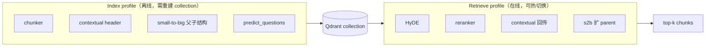

# Profile 与 Capability 选型指南

本文说明如何根据场景选择 **RAG profile**（`arg_config.yaml`）与 **Agent capability / pattern**（`agent_arg_config.yaml`）。  
目标不是给出「唯一最优解」——不同语料、query 形态、延迟预算下最优组合不同；本文帮助你在 **成本、延迟、复杂度** 之间做有意识的选择，并用评测验证假设。

配置入口：

| 层 | 文件 | 运行时绑定 |
|----|------|------------|
| RAG 全局旋钮 | `arg_config.yaml` → `chunker` / `retriever` | 所有 profile 共享 |
| RAG 索引策略 | `arg_config.yaml` → `index_profiles` | 建库时选定 → 一个 profile 对应一个 Qdrant collection |
| RAG 检索策略 | `arg_config.yaml` → `retrieve_profiles` | 查询时选定 → **无需重建索引** |
| Agent pattern | `agent_arg_config.yaml` → `patterns` | `RequestConfig.pattern_id` 或手动 `AgentConfig` |
| LLM 上下文预算 | `agent_arg_config.yaml` → `rag_context.max_chunks` | 注入 Agent 的 RAG chunk 上限 |

---

## 1. 先理解两层 Profile



**选型原则**

1. **索引侧**决定「文档怎么切、怎么存」——改 index profile 必须 re-index。  
2. **检索侧**决定「query 怎么变换、怎么精排」——同一 collection 上可换 retrieve profile 做 ablation。  
3. **`use_small_to_big` 检索** 要求 index profile 也开了 s2b（否则没有 parent 结构可用）。  
4. 默认部署参考：`index_profiles.baseline` + `retrieve_profiles.rerank_contextual`（见 `rag/config.py`）。

---

## 2. 全局旋钮（所有 profile 共享）

### `chunker`

| 字段 | 默认 | 作用 |
|------|------|------|
| `chunk_tokens` | 512 | 目标块大小（token chunker 硬切；semantic chunker 软上限） |
| `overlap_tokens` | 64 | 相邻块重叠，减少边界断句损失 |
| `break_similarity` | 0.5 | SemanticChunker 断句阈值（越低 → 块越多、越碎） |
| `min_chunk_tokens` | 120 | s2b child 最小长度 |

**调参提示**

- 法条 / API 参考：可略减 `chunk_tokens`（256–384），配合 s2b 扩 parent。  
- 长叙事文档：semantic + 较大 `chunk_tokens` 往往比硬切 token 更稳。  
- overlap 增大 → 索引体积与 embedding 成本上升，但边界 recall 可能改善。

### `retriever`

| 字段 | 默认 | 作用 |
|------|------|------|
| `recall_n` | 50 | 向量初召回条数（rerank 前） |
| `top_k` | 3 | 最终返回 LLM / gate 的条数 |

**调参提示**

- 开 rerank 时：`recall_n` 宜明显大于 `top_k`（当前 50→3 是常见生产比例）。  
- 仅 `plain` 无 rerank 时，过大 `recall_n` 对最终 top-k 帮助有限，还增 latency。  
- Agent 侧 `rag_context.max_chunks` 默认 `3 × top_k`；上下文紧张时可显式设小。

---

## 3. Index profile 选型

每个 index profile 对应 **一种建库策略**（通常一个 Qdrant collection）。

| profile_id | 开启项 | 优势 | 劣势 | 适用场景 |
|------------|--------|------|------|----------|
| **`token`** | `use_token_chunker` | 行为确定、建库快、无 embedding 分块开销 | 易在句中断开；对结构感弱的纯文本较差 | ablation 对照组；格式规整的日志 / 表格 |
| **`semantic`** | （默认 SemanticChunker） | 按语义边界切分，块更连贯 | 分块耗时高于 token；块大小波动 | 技术文档、Markdown、章节结构清晰的内容 |
| **`baseline`** | `use_contextual` | 为 chunk 附加标题路径 / 文档元数据 header，embedding 与回传上下文更完整 | 索引体积略增；**不**含 LLM 调用（header 为规则生成） | **推荐默认起点**；大多数企业知识库 |
| **`s2b`** | contextual + `use_small_to_big` | child 精定位 + parent 宽上下文（512 child / 3072 parent window） | 索引结构复杂、存储翻倍级；检索路径更长 | 需「定位一句、理解一段」：合同、手册、长 API 页 |
| **`predict_q`** | contextual + `use_predict_questions` | 用户问法与文档表述不一致时提高 recall | **每 chunk 一次 LLM**；建库成本最高、最慢 | FAQ 型、口语化 query 多的场景；值得单独 ablation |
| **`full`** | contextual + s2b + predict_q | 索引侧能力全开，上限配置 | 成本、延迟、复杂度最高； rarely 作为第一选择 | 评测 ablation 上限；**不是**默认生产配置 |

### Index 侧开关详解

| 开关 | 解决的问题 | 成本 |
|------|------------|------|
| `use_token_chunker` | 需要可复现、廉价的对照分块 | 低 |
| `use_contextual` | 孤立 chunk 脱离文档语境，embedding 语义不完整 | 低（规则 header，无 LLM） |
| `use_small_to_big` | 小块召回准、大块才能答对 | 中（存储 + 检索逻辑） |
| `use_predict_questions` | query 与 passage 表述 gap | 高（LLM × chunk 数） |

---

## 4. Retrieve profile 选型

Retrieve profile **不触发 re-index**，可在同一 collection 上对比。

| profile_id | 开启项 | 优势 | 劣势 | 适用场景 |
|------------|--------|------|------|----------|
| **`plain`** | 无 | 延迟最低、无额外 API；适合 baseline | 向量分数噪声大，top-k 易混入「相似但不相关」 | 成本敏感、或作为 ablation 零点 |
| **`rerank`** | `use_reranker` | 显著改善精排；生产 RAG 常见标配 | 多一次 rerank API；依赖 `RERANK_*` 或 embedding rerank | **大多数在线检索的最低生产配置** |
| **`rerank_contextual`** | rerank + `use_contextual` | 回传 chunk 时 prepend header，LLM / reranker 看到更完整语境 | 比纯 rerank 略增 token | **仓库默认 retrieve profile**；与 `baseline` index 配对 |
| **`rerank_s2b`** | rerank + contextual + `use_small_to_big` | 召回 child、扩展 parent，兼顾定位与上下文 | 需 s2b index；延迟高于纯 rerank | 与 `s2b` index 配套 |
| **`rerank_hyde`** | rerank + contextual + `use_hyde` | 短 query、术语 gap 大时拉近 query-doc 语义 | **每 query 一次 LLM** 生成 hypothetical doc；延迟与成本上升 | 搜索框短问、口语化提问 |
| **`full`** | 全开（含 retrieve 侧 predict_q 标志*） | 检索侧能力上限 | 延迟、成本最高；组件越多越难归因 | ablation 上限；先证明单项有效再组合 |

\* 当前 retrieve `full` 中的 `use_predict_questions` 主要与 profile  schema 对齐；predict_q 的 LLM 开销发生在 **索引期**。检索期仍以向量 + HyDE + rerank 为主。

### Retrieve 侧开关详解

| 开关 | 解决的问题 | 成本 |
|------|------------|------|
| `use_reranker` | 向量相似 ≠ 任务相关 | 中（rerank API / cross-encoder） |
| `use_contextual` | LLM 看到的 chunk 缺少 section 语境 | 低（拼接已存 header） |
| `use_hyde` | query 过短或与文档 embedding 空间不对齐 | 中–高（LLM / query） |
| `use_small_to_big` | top-k child 太窄，无法支撑推理型回答 | 中（多读 parent 窗口） |

---

## 5. Index × Retrieve 兼容与推荐组合

| 你想解决的问题 | 推荐 index | 推荐 retrieve | 说明 |
|----------------|------------|---------------|------|
| 快速上手 / demo | `baseline` | `rerank` 或 `rerank_contextual` | 平衡效果与复杂度 |
| 最低成本 PoC | `semantic` 或 `token` | `plain` | 先验证链路，再加 rerank |
| 生产默认（文档库） | `baseline` | `rerank_contextual` | 与代码默认一致 |
| 长文档精确定位 | `s2b` | `rerank_s2b` | 两侧 s2b 必须同时开 |
| 短问 / 搜索型 query | `baseline` | `rerank_hyde` | HyDE 仅检索侧，不必重建 index |
| 口语化 FAQ | `predict_q` | `rerank_contextual` | 索引成本高，先小语料验证 |
| 全量 ablation | `full` | `full` | 测上限；逐项关闭比从零叠加更可解释 |

**常见错误**

- 对 `semantic` index 开 `rerank_s2b`，但 index 未建 s2b 结构 → parent 扩展无效。  
- index 用 `predict_q` 建库，retrieve 却用 `plain` → 浪费索引 LLM 成本，精排增益未发挥。  
- 无 rerank 却把 `recall_n` 拉到很大 → latency 涨但 top-k 质量未必改善。

---

## 6. 按场景的一页决策树

```
开始
 ├─ 还在搭链路 / 无 rerank key？
 │    └─ index: semantic 或 baseline · retrieve: plain
 ├─ 有 rerank，一般企业文档？
 │    └─ index: baseline · retrieve: rerank_contextual
 ├─ 单 chunk 太短、回答缺上下文？
 │    └─ index: s2b · retrieve: rerank_s2b
 ├─ 用户 query 很短或口语化？
 │    └─ 保持 index: baseline · retrieve: rerank_hyde（对比 rerank_contextual）
 └─ 建库预算充足、recall 是瓶颈？
      └─ index: predict_q（小样本 ablation）· retrieve: rerank_contextual
```

---

## 7. Agent Capability 选型

Capability 与 RAG profile 正交：**profile 决定「怎么检索」；capability 决定「检索之后 Agent 怎么决策」**。

### 7.1 `enable_retrieval_gate`（CRAG 思路）

**行为**：RAG / 联网工具返回后，用 rerank 分数对 passages 打分；低于阈值（默认 `0.5`）则 verdict 为 reject，剥离无效回答、回到 LLM 重试或换策略。

| 优势 | 劣势 |
|------|------|
| 降低「检索不到还硬答」的幻觉风险 | 额外 rerank 调用；可能增加轮次与总 latency |
| 对生产环境「宁可拒答、不可胡编」友好 | 阈值需按语料调；过低误杀、过高形同虚设 |
| 与具体 retrieve profile 解耦，可叠加任意 profile | 需要 `RERANK_*` 或自定义 `score_fn` |

**何时开启**

- 面向用户的 QA，错误回答代价高。  
- 语料覆盖不全，经常检索 miss。  
- 已具备 rerank 能力（与 `rerank` retrieve profile 天然配套）。

**何时关闭**

- 内部调试、只关心 recall 的检索评测。  
- 延迟极敏感且可接受偶发幻觉。  
- 纯 ReAct 基线对比实验。

### 7.2 `enable_rag_profile_router`（Self-RAG 思路）

**行为**：LLM 调用 `RAG_search_tool` 时可附带 retrieve profile 参数（`use_hyde`、`use_reranker`、`recall_n`、`top_k` 等）；router 节点校验、合并部署默认值并写入 metadata。

| 优势 | 劣势 |
|------|------|
| 不同 query 自动选不同检索强度（短问 → HyDE，简单 factoid → plain rerank） | 多一次 LLM 决策；tool schema 更复杂，小模型易选错 |
| 避免为全局固定一种 retrieve profile | 需要 prompt 约束 + 可选 `max_recall_n` / `max_top_k` 护栏 |
| 与固定 deployment profile 兼容（未指定参数时用默认值） | 路由错误时比固定 profile 更难 debug |

**何时开启**

- query 形态差异大（长短问、多轮指代、术语 vs 口语并存）。  
- 已在 ablation 中证明 **多种 retrieve profile 各有胜出场景**。  
- 愿意接受略高 token / 延迟换自适应。

**何时关闭**

- 语料与 query 形态单一，固定 `rerank_contextual` 足够。  
- 小模型 tool-call 不稳定。  
- 需要完全可复现的 benchmark 跑分（固定 profile 更公平）。

### 7.3 `enable_human_feedback`

**行为**：暴露 `request_clarification` 工具；图在 LangGraph `interrupt` 处暂停，等待用户澄清后再继续。

| 优势 | 劣势 |
|------|------|
| 歧义 query、缺参数任务可主动追问 | **必须**有 checkpointer + 人机交互 UI / CLI resume |
| 减少盲目检索与错误前提下的长链路 | 不适合全自动批处理评测 |
| 适合 copilot 类产品体验 | 增加会话状态管理复杂度 |

**何时开启**

- 交互式助手、参数缺失时应追问用户。  
- 有前端或 CLI 处理 `interrupt` resume。

**何时关闭**

- 批量 QA 评测、无人工在环的 API 服务。  
- 自动化 pipeline（`get_start` 示例、RAGChecker infer）。

### 7.4 `rag_context.max_chunks`

| 值 | 效果 |
|----|------|
| `null`（默认） | `3 × retriever.top_k`（默认 top_k=3 → 最多 9 chunks 进 LLM） |
| 整数 | 硬上限；控制 context 长度与成本 |

检索 gate 仍基于工具返回的 passages；缩小 `max_chunks` 主要影响 **最终生成阶段** 读入多少证据。

---

## 8. Agent Pattern 预设（`agent_arg_config.yaml`）

Pattern 是 capability 的**命名组合**，便于 `get_start` 与评测复用。

| pattern | retrieval_gate | rag_profile_router | human_feedback | 定位 |
|---------|:--------------:|:------------------:|:----------------:|------|
| **`react`** | | | | 基线 ReAct；固定 retrieve profile，无门控 |
| **`self_rag`** | | ✓ | | 自适应检索策略；适合 query 多样 |
| **`crag`** | ✓ | | | 检索质量门控；适合「不能瞎答」 |
| **`crag_self_rag`** | ✓ | ✓ | | 自适应 + 门控；复杂度最高，延迟最大 |
| **`feedback`** | | | ✓ | 人机澄清；需 checkpointer |
| **`full`** | ✓ | ✓ | ✓ | 能力全开；调试与 demo，非默认生产 |

### Pattern 选型建议

| 场景 | 推荐 pattern | 搭配 RAG |
|------|--------------|----------|
| 本地 demo / 学习 LangGraph | `react` | `baseline` + `rerank_contextual` |
| 检索 benchmark（固定策略） | `react` | 显式指定 index + retrieve profile |
| 生产 QA（质量优先） | `crag` | `baseline` + `rerank_contextual` |
| 开放域、query 形态杂 | `self_rag` | index 固定，`retrieve` 由 router 选择 |
| 质量 + 自适应都要 | `crag_self_rag` | 先分别验证 crag 与 self_rag 单项收益 |
| 对话式 copilot | `feedback` 或 `full` | 按是否需要 gate/router 叠加 |

**组合逻辑**

- **gate + router 同时开**：router 选策略，gate 判结果够不够——适合高要求场景，但轮次与 API 调用显著增加。  
- **仅 gate**：retrieve profile 在部署时固定，行为更可预测，运维更简单。  
- **仅 router**：允许hyde/rerank 等切换，但不强制 reject 低分检索——幻觉风险高于 `crag`。

---

## 9. 成本与延迟粗估（相对）

以 **`baseline` index + `rerank_contextual` retrieve + `react` pattern** 为 1.0 基准：

| 配置变更 | 索引成本 | 单次检索成本 | Agent 轮次风险 |
|--------|:--------:|:------------:|:--------------:|
| index `token` vs `semantic` | ≈ | ≈ | ≈ |
| index + `predict_q` | ↑↑↑ | ≈ | ≈ |
| index + `s2b` | ↑ | ↑ | ≈ |
| retrieve `plain` → `rerank` | — | ↑ | ≈ |
| retrieve + `hyde` | — | ↑↑ | ≈ |
| pattern + `crag` | — | ↑（gate rerank） | ↑ |
| pattern + `self_rag` | — | 波动 | ↑ |
| pattern + `crag_self_rag` | — | ↑↑ | ↑↑ |

具体倍数依赖语料规模、chunk 数、模型单价；**务必用自家语料跑 trace + 评测**，本文只作优先级排序。

---

## 10. 推荐落地流程（评测未完成时也适用）

1. **固定 index**：先用 `baseline` 建库（或 `semantic` 作 chunk 对照）。  
2. **扫描 retrieve**：在同一 collection 上跑 `plain` → `rerank` → `rerank_contextual` → `rerank_hyde`（BEIR / 自建 gold）。  
3. **按需加 index 能力**：若 recall 瓶颈在 chunk 语境 → 已含 contextual；若仍不足 → 试 `s2b` 或 `predict_q`。  
4. **再接 Agent**：用 `react` + 选定的 retrieve profile 建立端到端 baseline。  
5. **叠加 capability**：分别打开 gate、router，对比 RAGChecker 的 faithfulness / hallucination，而非只看检索 recall。  
6. **收敛生产配置**：在「指标达标」的 combo 里选 **延迟 / 成本最低** 的一个，避免无脑 `full`。

> **说明**：本仓库新一代 BEIR / RAGChecker 全量报告尚未定稿；legacy HotpotQA 子集上多数 profile 差异不大（见 `docs/_Eval_ (Legacy)/hotpotqa.md`），说明 **简单语料上堆策略收益有限**——更要在目标语料上复验，而非假设 `full` 总是更好。

---

## 11. 快速对照表

### 我该用哪个 RAG profile？

| 如果你… | Index | Retrieve |
|---------|-------|----------|
| 第一次跑通 | `baseline` | `rerank_contextual` |
| 没有 rerank API | `baseline` | `plain` |
| 长页文档 | `s2b` | `rerank_s2b` |
| 短搜索 query | `baseline` | `rerank_hyde` |
| 做论文式 ablation | 逐项叠加 | 逐项叠加 |

### 我该用哪个 Agent pattern？

| 如果你… | Pattern |
|---------|---------|
| 要可复现 baseline | `react` |
| 检索质量不确定、不能瞎答 | `crag` |
| query 类型混杂 | `self_rag` |
| 要交互澄清 | `feedback` |
| 全都要（先别上生产） | `full` |

---

## 相关文档

| 文档 | 内容 |
|------|------|
| [README — RAG 配置](../README.md#rag-配置) | profile 字段与代码 API |
| [README — Agent](../README.md#agent) | `AgentConfig` 与 `build_agent` |
| `arg_config.yaml` | index / retrieve profile 定义 |
| `agent_arg_config.yaml` | pattern 预设 |
| `docs/RAG_retrieve_eval_results.md` | 检索 ablation 报告（随评测补充） |
| `docs/Eval_report.md` | 端到端 RAGChecker 报告（随评测补充） |
