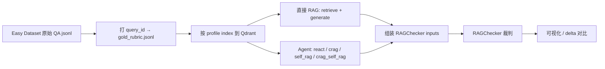

# Eval Blueprint

> 系统化评测方案：Easy Dataset 出题 → `get_start` 跑被测系统 → [RAGChecker](https://github.com/amazon-science/RAGChecker) 裁判 → 可视化对比。
>
> **替代** 旧 `_eval_`（BEIR / rubric judge）。目标：**要赢**——证明索引 profile、Agent pattern 相对 baseline 有可量化提升。

---

## 1. 目标与对比维度

| 层级 | 对比 | 预期 |
|------|------|------|
| **索引** | `token` → `baseline` | semantic + contextual + rerank 优于纯 token chunk |
| **检索 profile** | `baseline` → `baseline_s2b` / `baseline_predict_q` / `baseline_hyde` / `full` | 各 knob 有边际或叠加收益 |
| **Agent 模式** | 直接 RAG（retrieve）→ `crag` / `self_rag` / `crag_self_rag` | 门控 / router / 组合优于裸检索+生成 |

---

## 2. 三方角色

| 组件 | 职责 | 位置 |
|------|------|------|
| [Easy Dataset](https://github.com/ConardLi/easy-dataset) | 从文档生成 QA 对 | 外部；gold 见 `_eval_/datasets/Easy-Dataset/gold_rubric.jsonl` |
| **被测系统** | index / retrieve / agent | `get_start/index_example.py`, `retrieve_example.py`, `agent_example.py` |
| [RAGChecker](https://github.com/amazon-science/RAGChecker) | claim-level 裁判 | 外部；`pip install ragchecker` |

配置：

- RAG profiles → `arg_config.yaml`
- Agent patterns → `agent_arg_config.yaml`

---

## 3. 数据流



---

## 4. 已拍板决策

### 4.1 Ground truth：`answer`

RAGChecker 的 `gt_answer` 使用 `gold_rubric.jsonl` 中的 **`answer`** 字段（精炼标准答案）。

不使用 `draft_answer`（长文详解，仅人审备用）。

### 4.2 `retrieved_context` 口径：A

| Run 类型 | `retrieved_context` 来源 |
|----------|--------------------------|
| **直接 RAG**（retrieve 路径） | `retrieve.json` → `stages.final[]` |
| **Agent**（react / crag / …） | `agent_*.json` → 从 `ToolMessage` 解析 chunk，**去重合并** |

`doc_id`：优先 `chunk_id`；缺失时用 `source`。

`text`：使用 chunk 的 **`content`**（不含 contextual header 前缀）。

### 4.3 「直接 RAG」定义

**直接 RAG = `get_start/retrieve_example.py` 中的 RAG 管线**（profile 对齐的 retriever：`aquery_trace` → `stages.final`），再加 **单轮 LLM 生成**。

不是 `react` pattern。Agent 对比的是：**同一 profile 下，retrieve 基线 vs 各 reflection pattern**。

实现：`eval/infer/direct_rag.py` → `DirectRagArm`（retrieve + `LLMClient` 单轮 generate）。

### 4.4 实验矩阵

**Profiles**（6，每个 profile 单独 index → 独立 Qdrant collection）：

| Profile | 开关摘要 |
|---------|----------|
| `token` | `use_token_chunker` |
| `baseline` | contextual + reranker |
| `baseline_s2b` | baseline + small-to-big |
| `baseline_predict_q` | baseline + predict_questions |
| `baseline_hyde` | baseline + HyDE |
| `full` | contextual + rerank + s2b + hyde + predict_q |

**Agent patterns**（4）：

| Pattern | 能力 |
|---------|------|
| `react` | 无 gate / 无 router |
| `crag` | retrieval gate |
| `self_rag` | rag profile router |
| `crag_self_rag` | gate + router |

**Run 规模**：

```
6 profiles × 4 patterns  = 24 agent runs
6 profiles × 1 direct RAG =  6 retrieve runs
─────────────────────────────────────────
合计                      = 30 runs
```

Collection 命名：`{collection_prefix}_{profile_id}`（eval 默认 `eval_codex_baseline`；`get_start` smoke 用 `getstart_codex_baseline`）。

Run 标识建议：`{doc_slug}__{profile_id}__{arm}`，其中 `arm` 为 `direct_rag` | `react` | `crag` | `self_rag` | `crag_self_rag`。

### 4.5 RAGChecker judge 模型

**待定。** 需确认本地 `.env` 可用的 `extractor_name` / `checker_name`（官方示例为 Bedrock Llama3-70B）。定稿后回填本节。

### 4.6 题型过滤

**只评测 `open_ended` + `short_answer`**，排除 `multiple_choice` / `single_choice` / `true_false`（RAGChecker claim entailment 对自然语言 QA 更友好）。

当前 Codex gold（`_eval_/datasets/Easy-Dataset/gold_rubric.jsonl`）：

| question_type | 数量 | 纳入 |
|---------------|------|------|
| `open_ended` | 8 | ✅ |
| `short_answer` | 4 | ✅ |
| `multiple_choice` | 5 | ❌ |
| `single_choice` | 6 | ❌ |
| `true_false` | 4 | ❌ |
| **合计** | **27** | **12 题** |

单次全矩阵：**30 runs × 12 queries = 360** 条 RAGChecker input record。

---

## 5. RAGChecker 输入契约

```json
{
  "results": [
    {
      "query_id": "工程技术-在智能体优先的世界中利用-codex::q0000",
      "query": "<gold_rubric.question>",
      "gt_answer": "<gold_rubric.answer>",
      "response": "<generated answer>",
      "retrieved_context": [
        {"doc_id": "<chunk_id or source>", "text": "<chunk content>"}
      ]
    }
  ]
}
```

### 字段映射

| RAGChecker 字段 | 来源 |
|-----------------|------|
| `query_id` | `gold_rubric.query_id` |
| `query` | `gold_rubric.question` |
| `gt_answer` | `gold_rubric.answer` |
| `response` | 直接 RAG：retrieve+generate 输出；Agent：`final_message.content` |
| `retrieved_context` | 见 §4.2 |

### RAGChecker 输出指标

```json
{
  "overall_metrics": {
    "precision": 0.0,
    "recall": 0.0,
    "f1": 0.0
  },
  "retriever_metrics": {
    "claim_recall": 0.0,
    "context_precision": 0.0
  },
  "generator_metrics": {
    "context_utilization": 0.0,
    "noise_sensitivity_in_relevant": 0.0,
    "noise_sensitivity_in_irrelevant": 0.0,
    "hallucination": 0.0,
    "self_knowledge": 0.0,
    "faithfulness": 0.0
  }
}
```

---

## 6. 目录结构

### 6.1 现状（代码已落地）

流水线逻辑在 **`eval/` 根目录的 Python 模块**里，没有单独的 `scripts/` 子目录：

```
eval/
  eval_blueprint.md          ← 本文件
  __init__.py                ← 公共 re-export
  types.py                   ← TypedDict / 常量（数据形状地图）
  gold.py                    ← load_eval_gold / 题型过滤
  run_config.py              ← EvalRunConfig、build_run_matrix、路径 helper
  index.py                   ← index_profiles（批量 index）
  assemble.py                ← infer + gold → RAGChecker input
  score.py                   ← RAGChecker 封装
  compare.py                 ← metrics delta
  pipeline.py                ← 四阶段编排（index → infer → assemble → score）
  run.py                     ← CLI：python -m eval.run
  infer/
    base.py                  ← BaseInferArm (ABC)
    direct_rag.py            ← DirectRagArm
    agent.py                 ← AgentInferArm
  runs/                      ← 运行时产物（首次写入时自动创建）
    retrieve/                ← direct_rag infer 结果 JSON
    agent/                   ← agent infer 结果 JSON
    checking_inputs/         ← RAGChecker 输入
    checking_outputs/        ← RAGChecker 输出
```

Gold 仍读 `_eval_/datasets/Easy-Dataset/gold_rubric.jsonl`（`eval/gold.py` 默认路径），未复制到 `eval/datasets/`。

### 6.2 与初版规划的差异

| 初版规划 | 现状 | 说明 |
|----------|------|------|
| `scripts/` 批量流水线 | `pipeline.py` + `run.py` | 功能已实现在根目录，未单独建 `scripts/` |
| `runs/index/` index 元数据 | **未落盘** | `index_profiles()` 返回 `IndexResult`，不写 JSON |
| `datasets/` gold 副本 | **未建** | 继续读 `_eval_/datasets/...` |
| `visual/` 对比图 | **未建** | `compare.py` 只有 delta 计算，无可视化 |

### 6.3 `runs/` 文件命名

由 `eval/run_config.py` 的 path helper 决定：

| 子目录 | 路径模式 | 内容 |
|--------|----------|------|
| `retrieve/` | `{doc_slug}__{profile_id}__direct_rag.json` | `InferResult[]` |
| `agent/` | `{doc_slug}__{profile_id}__{arm}.json` | `InferResult[]` |
| `checking_inputs/` | `{run_id}.json` | RAGChecker input |
| `checking_outputs/` | `{run_id}.json` | RAGChecker metrics |

示例：`codex__baseline__crag_self_rag.json`

旧路径 `_eval_/` **只作参考**（Easy-Dataset gold、visual 样式），新流水线以 `eval/` 为准。

---

## 7. 对比分析（Step 5）

可视化 / 报告至少覆盖：

1. **Profile ablation**：`token` vs `baseline` vs `full`（及中间 knob）— overall F1、claim_recall、faithfulness
2. **Agent ablation**（固定 `baseline` profile）：direct RAG vs `react` vs `crag` vs `self_rag` vs `crag_self_rag`
3. **Delta 热力图**：每个 `(profile, pattern)` 相对 `token` + direct RAG 的 ΔF1
4. **分题型**：`open_ended` vs `short_answer` 分项（样本量小，作参考）

---

## 8. 前置条件

- `.env`：`EMBEDDING_API_KEY`、`LLM_API_KEY`；CRAG 还需 `RERANK_API_KEY`（或 fallback `EMBEDDING_API_KEY`）
- Qdrant：`127.0.0.1:6333`
- RAGChecker：`pip install ragchecker` + `python -m spacy download en_core_web_sm`
- Index 先于 infer：`python -m eval.run index --doc-slug codex`（或 `get_start` smoke）

---

## 9. 开放项

| 项 | 状态 |
|----|------|
| RAGChecker extractor / checker 模型 | 待定 |
| `runs/index/` index 元数据落盘 | 未实现 |
| `eval/visual/` 热力图 / notebook | 未实现 |
| gold 迁到 `eval/datasets/` | 可选 |
| `get_start/` smoke 与 `eval/` 统一 collection 前缀 | 可选（当前 eval 用 `eval_codex_*`） |

---

## 10. 快速参考命令

### eval 流水线（推荐）

```bash
# 1. 批量 index（6 profiles）
python -m eval.run index --doc-slug codex

# 2. 单 run infer
python -m eval.run infer --doc-slug codex --profile baseline --arm direct_rag
python -m eval.run infer --doc-slug codex --profile baseline --arm crag_self_rag

# 3. 组装 RAGChecker input
python -m eval.run assemble --doc-slug codex --profile baseline --arm direct_rag

# 4. 打分（judge 模型待定）
python -m eval.run score --doc-slug codex --profile baseline --arm direct_rag \
  --extractor <TBD> --checker <TBD>

# 5. 对比两条 run
python -m eval.run compare --doc-slug codex \
  --baseline-profile token --baseline-arm direct_rag \
  --candidate-profile baseline --candidate-arm crag_self_rag

# 6. 全矩阵（index → infer → assemble → score）
python -m eval.run full --doc-slug codex --extractor <TBD> --checker <TBD>
```

### get_start smoke（单题调试）

```bash
python -m get_start.index_example
python -m get_start.retrieve_example
python -m get_start.agent_example --pattern crag_self_rag
```

### RAGChecker CLI（直连）

```bash
ragchecker-cli \
  --input_path=eval/runs/checking_inputs/codex__baseline__direct_rag.json \
  --output_path=eval/runs/checking_outputs/codex__baseline__direct_rag.json \
  --extractor_name=<TBD> \
  --checker_name=<TBD> \
  --metrics all_metrics
```
